<!-- Slide number: 1 -->
소프트웨어 개발/유지보수비 산출을 위한
기능점수(FP) 산정

ICT운영처 디지털SW운영실

### Notes:
123123123

<!-- Slide number: 2 -->
소개

강사 소개

(’23.07~현재 ) ICT운영처 전자조달시스템부 근무

(’22.08~’23.07 ) 경남본부 전력관리처 전자제어부 근무

(’20.01~’22.08 ) ICT운영처 ICT운영총괄부 (전사 ICT위탁)

(’19.07~’20.01 ) ICT운영처 경영시스템부 (ERP MM/BC, 전사PC구매)

(’18.01~’19.07) ICT운영처  영업시스템부 (전사 전산위탁)

심준영 (17110071)
ICT운영처 디지털SW운영실 전자조달시스템부
정보시스템 수석 감리원 (‘16.12)
컴퓨터시스템응용 기술사 (’16.05)
학점은행제-전자계산학(‘07.02)

(’17.05~’17.12 ) 감리법인 씨에이에스
   - 법무부 차세대 이민행정시스템 PMO (3개월)
   - 농어촌공사 농지은행시스템 ISMP (5주)
   - 사학연금 등 정보시스템감리 2회

(’14.10~’16.09 ) 씨월드정보기술 CJ텔레닉스IT서비스팀 (콜인프라)

(’07.08~’12.08) 6군단 정보대대 근무(육군 중사 전역)

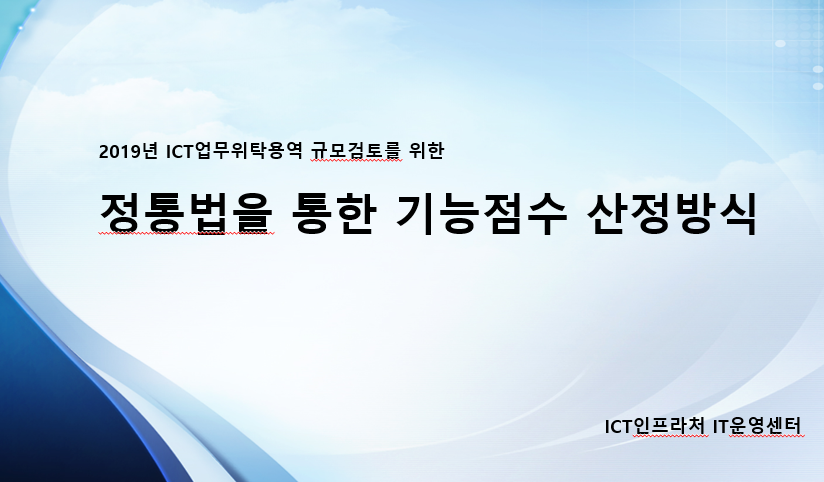

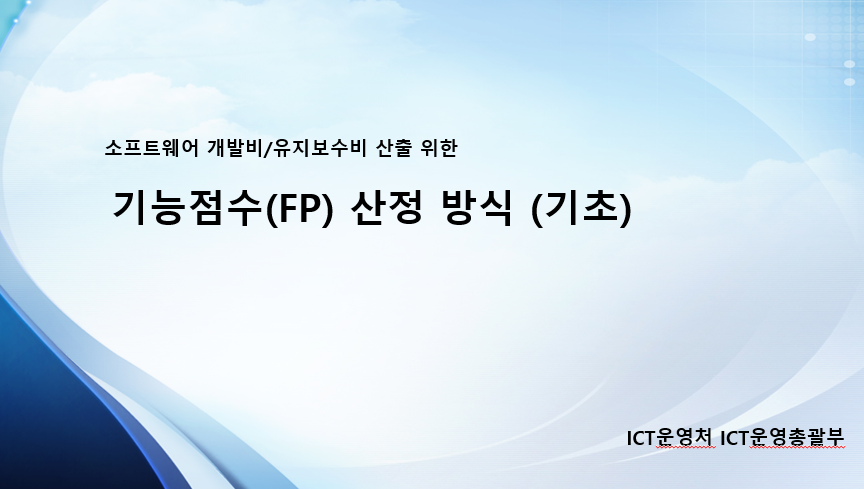
’21년 자체교육 시행
‘19.04 자체교육 시행

2

### Notes:
강사소개. 박제해두자

<!-- Slide number: 3 -->

01 소프트웨어 대가산정

Contents
02 사용자 체감 기능 중심의 규모산정, 기능점수(Function Point)

03 기능점수 산정 절차 및 방법 (간이법)

04 주요 오산정 사례

05 실습

06 참고사항 (관련교육 등)

### Notes:

1
2
3
4
5

<!-- Slide number: 4 -->
소프트웨어 대가산정

★
소프트웨어 개발비용 산정의 필요성
소프트웨어 개발사업 관점
소프트웨어 유지관리 사업 관점
SW규모파악(양적크기 및 질적수준)을 통해
소요공수, 투입인력, 개발기간 등을 파악하여
실행 가능한 프로젝트 계획을 수립
현 시점 기준의 개발비용 역산을 통한
연간 유지관리 비용 산정

[연간유지보수비 = “현 시점 규모의” 개발비 × 요율(10~15%)]

② 수주자
① 발주자
초기 구축 이후 시스템 규모의 지속 변경

보완개발
유지관리

프로젝트 발주 시 예정가격 산정의 기준

사업의 소프트웨어 규모 산정 내역서 확인

적정 사업비
예측 가능
개발용역 사업에 요구되는 필요 공수 및 적정 대가 확인
매 유지관리 계약 시 마다 적정 대가적정 유지관리 사업 비용 산출
SW의 [개발 비용] 및 [유지관리 비용] 산정을 위하여, 대상 시스템의 규모산정이 요구

4

### Notes:
1. 소프트웨어 대가산정1.1. 소프트웨어 개발비용 산정의 필요성 (2안 - 완)

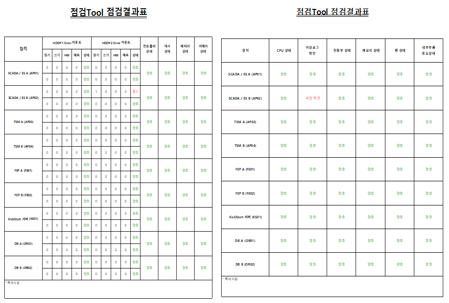

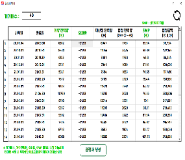

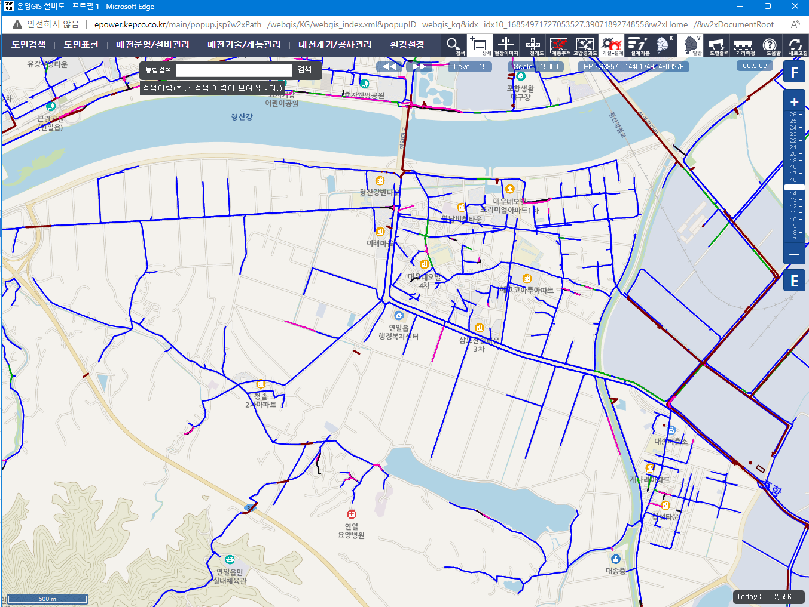

<!-- Slide number: 5 -->
소프트웨어 대가산정

소프트웨어 개발비용 산정 절차

01
소프트웨어 범위정의
프로젝트
요구사항 발생

02
규모산정
보정 전 개발비 산정 / FP, LOC 등

03
(보정 후) 개발비 산정
※ 보정계수 적용(비기능요구사항 등 반영)

04
이윤, 직접경비 산정

5

### Notes:
1. 소프트웨어 대가산정1.2. 소프트웨어 개발비용 산정 절차

<!-- Slide number: 6 -->
소프트웨어 대가산정

소프트웨어 개발비용 산정 방식
| 구분 | 하향식 | 상향식 | 수학식 |
| --- | --- | --- | --- |
| 개념 | - 경험과 전문지식이 많은 개발자들이 인력, 시스템, 크기, 필요 예산 등을 합의하여 결정하는 산정 방식 | - 업무분류 구조로 정의, 각 구성요소에 대한 산정을 독립적으로 실시한 후, 이를 집계하는 산정 방식 | - 프로젝트 개발비 산정의 자동화를 목표로 하는 산정방식 |
| 특징 | - 경험있는 사람이 있을 경우 효과적 - 양적 중심 설계 | - 기능을 세분화하여 분석 수행 - 양적 중심의 설계 | - 소프트웨어 비용산정의 자동화 - 기능 중심의 산정 |
| 장점 | - 소요시간이 적음 - 산정방식이 편리함 | - 산정 공식이 간단 - 수치자료로 산출되어 비교적 자료로서의 활용 용이 | - 정확한 산정이 가능 - View뿐 아니라 Data의 IN/OUT 처리 등 복합적인 요소 확인 가능 |
| 단점 | - 경험 있는 인력 부족 - 경험 있는 인력이 없으면 인증 불가 | - 많은 소요시간 필요 - 산정방법이 어려움 | - 처리방식이 복잡, 소요시간 과다 프로젝트 초기 산정 시 더욱 어려움 - 기능 식별/판정에 전문가 필요 |
| 기법 | - Delphi | - LOC, COCOMO | - FP, COCOMO2 |
국내 SW개발사업의 적정 개발비용 산정을 목적으로 하는 [SW사업 대가 산정 가이드] 에서는
SW규모산정에  SW규모산정에 FP(Fuction Point, ISO14143-1)을 기준으로 적용함.

6

### Notes:
1. 소프트웨어 대가산정1.3. 소프트웨어 개발비용 산정 방식

<!-- Slide number: 7 -->
소프트웨어 대가산정

★
[참고] SW사업 대가산정가이드 준용 기준

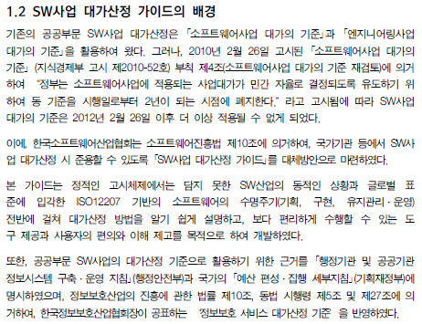
행정기관 및 공공기관 정보시스템 구축/운영 지침 (행정안전부)
국가의 예산편성 집행 세부지침
(기획재정부)

[7. 정보화 사업] 분야
SW사업 대가산정 가이드
(한국소프트웨어산업협회장 공표)
를 준용하여 적정 비용 편성

출처 : SW사업대가산정가이드(2024)

7

### Notes:
[참고] SW사업대가산정가이드 준용기준

<!-- Slide number: 8 -->
소프트웨어 대가산정

[참고] EA(Enterprise Architecture)
기업 내의 모든 정보시스템이 조직의 업무, 데이터, 기술요소 등의 구성요소들이 상호 연계되어 관리되는 프레임워크

| Input | Tech | Output |
| --- | --- | --- |
| BA, DA | AA, TA, SA | DA |
BA
(Business)
조직에서 수행하는 업무, 관련규정/지침, 절차 등을 정의
(업무를 위한 Task, Job, 내부규정, 지침, 절차서 등)
DA
(Data)
조직에서 관리 및 업무에 필요~파생되는 자료 요소
(사원정보, 고객정보, 재무재표, 가입정보, 사업정보 등)
TA
(Tech)
업무와 데이터를 효율적으로 관리/운영하기 위한 기술요소
(설비(서버, 네트웍장비, 스토리지) 및 SW(DBMS 등 상용SW))

AA
(Application)
조직에서 수행하는 업무를 지원하기 위한 개발프로그램 요소
(영배시스템, 재무회계시스템, 인사시스템 등의 애플리케이션)
AA관리를 위해 애플리케이션의
지속적 변경관리 요구 (기능목록 등)
SA
(Security)
조직 업무 수행을 위해 필수적인 보안 요소
 → 관리적, 물리적, 기술적 보안
※ 각 분야의 유기적 관리를 위한 품질관리(QM) 조직 필요

8

### Notes:
[참고]EA

<!-- Slide number: 9 -->

01 소프트웨어 대가산정

Contents
02 사용자 체감 기능 중심의 규모산정, 기능점수(Function Point)

03 기능점수 산정 절차 및 방법 (간이법)

04 주요 오산정 사례

05 실습

06 참고사항 (관련교육 등)

### Notes:

1
2
3
4
5

<!-- Slide number: 10 -->
기능점수(Function Point / FP)

★
기능점수(Function Point) 란
 사용자 관점에서 사용자가 요구하고 사용자에게 인도되는 기능을 정량적으로 산정하는
 소프트웨어 규모측정 방법

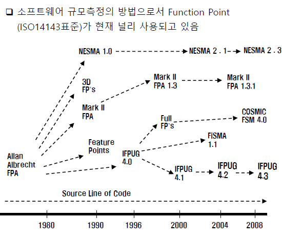
기능점수 방식
사용자의 업무적 요구사항에 대해 제공하는 소프트웨어의 기능을 논리적 관점에서 식별하여 사용자 관점에서 소프트웨어의 규모를 측정하는 방법 으로, 소프트웨어 기능 유형별 수량과 성능 및 품질요인들의 영향도를 고려 하여 소프트웨어의 규모를 측정하는 방법을 말한다.

기능점수(Function Point)
논리적 설계에 기초하여 사용자에게 제공되는 소프트웨어의 기능 규모를 정량적으로 표현하는 단위를 말한다.

출처 : 소프트웨어사업대가산정가이드(2024년/한국소프트웨어산업협회)
출처 : Charles Symons, Software Measurement Services Ltd

10

### Notes:
2. 기능점수
2.1 기능점수란

<!-- Slide number: 11 -->
기능점수(Function Point / FP)

★
기능점수 산정 범위
프로젝트 요구사항

기술적 요구사항
비기술적 요구사항

기능 요구사항
비기능 요구사항
정보등록, 정보출력, 정보조회, 계산, 분석, 통계 등과 같이 눈으로 식별 가능(메뉴구성)
속도, 성능, 정보보호, 개인정보보호, 웹표준, 웹접근성 등
[기능점수 산정 대상 아님]
: 생산성 영향 Factor이므로 보정계수로 반영
기능점수 산정 대상
기능, 비기능 요구사항은 중첩될 수 없음

11

### Notes:
2. 기능점수
2.2. 기능점수 산정 범위

<!-- Slide number: 12 -->
기능점수(Function Point / FP)

기능점수(Function Point) 표준

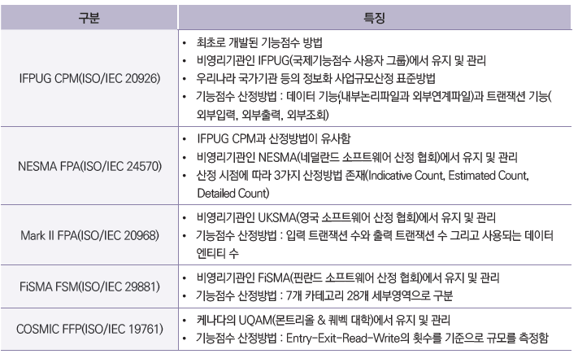

출처 : 국제표준기반 기능점수 산정 안내서

12

### Notes:
2. 기능점수
2.3 기능점수 표준(참고용)

<!-- Slide number: 13 -->
기능점수(Function Point / FP)

기능점수의 장점
사용자 관점 측정
단계별 측정 가능
 SW의 기능적 요구사항을 측정 → 사용자가 접하는 화면 등
SDLC의 모든 단계에서 측정 가능
→ 개발 이전에 개발공수, 사업비 측정 가능

※SDLC단계 : 분석-설계-개발-시험-운영

01

02
 일관성.
ISO/IEC 20926(CPM)
구현된 기능(화면)을 기준으로 측정
→ 기술, 공수, 개발방법론에 무관

03
소프트웨어 개발 유지관리 운영을 위한
자원소요 산정을 목적으로 하는 국제 표준

 ISO/IEC 14143(FSM/Functional Size Measurement)
ISO/IEC20296(CPM/Counting Practice Manual)

04

13

### Notes:
2. 기능점수
2.4 기능점수의 장점

<!-- Slide number: 14 -->
기능점수(Function Point / FP)

기능점수의 단점
전문가 필요
사용자 관점의 측정
 SW기능작성 위한 분석 능력 요구 → 시스템 및 FP 대한 높은 이해도

01
화면이 없는 데이터 처리, 전송 등과 같은
내부 로직 위주의 시스템에 부적합

02
개발규모 측정에 한정
단순화면 측정 안함
개발규모 측정에만 집중되어 개발에
소요되는 일정, 투입인력 측정 불가

03
기업소개, 사장님말씀, 링크모음 등과 같이
DBMS를 거치지 않는 단순 HTML 등 무시

04

14

### Notes:
2. 기능점수
2.5 기능점수의 단점

<!-- Slide number: 15 -->
기능점수(Function Point / FP)

기능점수 산정 방식
| 구분 | 간이법 | 정통법(정규법) |
| --- | --- | --- |
| 개념 | ○ 기능 유형별(지표) 평균복잡도를 적용하여 기능 점수를 산정하는 방식 (기능별 복잡도 산정이 어려울 경우 사용) | ○ 보다 정확한 기능점수 산정을 위하여 각 기능 유형별 복잡도를 적용하여 기능점수를 산정하는 방식 |
| 적용 시점 | ○ SDLC 전 단계에서 적용 가능. 기획, 발주단계에서 사전 도출 시에 사용 가능 (기능 정의서만으로도 작성 가능) | ○ 일반적으로 설계공정 이후 사용 (화면정의서, 테이블정의서, CRUD 등상세자료 필요) |
| 지표 | ○ 트랜잭션 : EI, EO, EQ ○ 데이터 : ILF(내부논리파일), EIF(외부연계파일) | ○ 트랜잭션 : EI, EO, EQ, FTR, DET ○ 데이터 : ILF(내부논리파일), EIF(외부연계파일), RET, DET |
| 장점 | ○ 측정 및 관련 지식 습득에 비교적 적은 시간 소요 | ○ 규모측정 정확도가 상대적으로 높음 |
| 단점 | ○ 규모측정 정확도가 상대적으로 낮음 | ○ 측정 및 관련 지식 습득에 많은 시간이 소요됨 |

 - 사용자 관점에서의 사용자가 요구하고 사용자에게 인도되는 기능을 정량적으로 산정하는 소프트웨어 규모 측정방법

15

### Notes:
2. 기능점수
2.6. 기능점수 산정방식 (간이법, 정통법)

<!-- Slide number: 16 -->
기능점수(Function Point / FP)

기능점수 산정 방식
| 구분 | 간이법 | 정통법(정규법) |
| --- | --- | --- |
| 방법 | 개략적인 설계로도 산출 가능 | 기능목록, 테이블정의서, 연계정의서, API정의서, 소스코드 등의 상세설계 내용 필요 |
|  | ① 기능정의 : 시스템에 정의된 기능 명시 ② 트랜잭션 기능 정의 : EI, EO, EQ ③ 데이터 기능 정의 : ILF, EIF ④ 기능별 평균 복잡도 적용 ⑤ 합계 | ① 기능정의 : 시스템의 요구사항에 따라 정의된 기능 정의 ② 트랜잭션 기능 정의 : EI, EO, EQ 분류 ③ FTR, DET정의 : 트랜잭션 기능별 참조 데이터 개수 정의 ④ 트랜잭션 기능별 복잡도 적용 : 개별 가중치 적용 ⑤ 데이터 기능 정의 : 기능별 참조 데이터 개수 정의 ⑥ RET, DET 정의 : 데이터 기능별 참조 데이터 개수 정의 ⑦ 데이터 기능별 복잡도 적용 : 개별 가중치 적용 ⑧ 합계(④+⑦) |

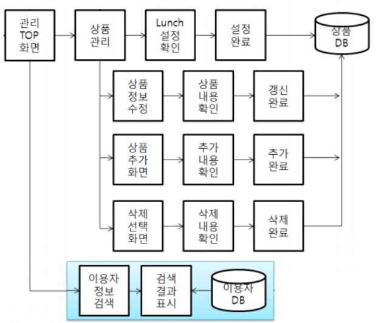

16

### Notes:
2. 기능점수
2.6. 기능점수 산정방식 (간이법, 정통법)

<!-- Slide number: 17 -->
기능점수(Function Point / FP)

★
기능점수 산정방식

간이법
정통법
평균복잡도
기능별 복잡도
SDLC전단계
상세 설계 후

17

### Notes:
2. 기능점수
2.7. 기능점수 산정방식 비교 요약 (간이법, 정통법)

<!-- Slide number: 18 -->
기능점수(Function Point / FP)

[참고] 정통법/간이법 수행 가능 구간
개발 예산 산정을 위해
<간이법>을 통한 규모/비용산정
분석 단계에서 도출된 요구 정의서를 통해
작성된 <기능명세서>를 기반으로 <간이법>으로 재산정
설계산출물을 기반으로 <정통법> 산정 가능

폐기
운영
/유지보수
RFI작성
/입찰공고
테스트
기술협상
/계약
분석
설계
개발

재개발
RFP제공

재개발 범위/규모산정
계획수립/발주
계획수립/발주
사업 진행

18

### Notes:
[참고] 정통법/간이법 수행 가능 구간

<!-- Slide number: 19 -->

01 소프트웨어 대가산정

Contents
02 사용자 체감 기능 중심의 규모산정, 기능점수(Function Point)

03 기능점수 산정 절차 및 방법 (간이법)

04 주요 오산정 사례

05 실습

06 참고사항 (관련교육 등)

### Notes:

1
2
3
4
5

<!-- Slide number: 20 -->
기능점수 산정 절차 및 방법 (간이법 기준)

기능점수 산정 절차

01
평가유형 설정

04
보정계수 적용
※ 비기능요구사항

02
경계설정
※ 대상 및 범주 설정

05
개발비용 산정

03
기능 산정
.보정 후 개발원가
.기능요구사항 : 데이터기능 + 트랜잭션기능
.보정 전 개발원가

20

### Notes:
3. 기능점수 산정 절차

<!-- Slide number: 21 -->
기능점수 산정 절차 및 방법 (간이법 기준)

기능점수 산정 절차

01

02

03

04

05
보정계수 적용
평가유형 설정
경계설정
기능산정
개발비 산정
데이터 기능
트랜잭션 기능
대상 및 범주 설정
비기능 요구사항 반영
① 평가유형 결정
   - 개발프로젝트, 개선프로젝트, 애플리케이션 유형 중 선택
| 평가 유형 | 설 명 | 적용 예 |
| --- | --- | --- |
| 개발프로젝트 | ○ 개발 완료 후, 사용자에게 제공되는 기능 측정 (최초 서비스) | 신규SI사업 |
| 개선프로젝트 | ○ 기존 시스템에 변경(추가개발 등)이 가해져 변경된 부분만을 측정 | 재개발 등 |
| 애플리케이션 | ○ 사용자에게 제공된(제공 중인) 애플리케이션의 현행 기능 측정 | 유지보수 |

21

### Notes:
3. 기능점수 산정 절차
3.1. 기능점수 산정 절차
3.1.1. 평가유형 설정

<!-- Slide number: 22 -->
기능점수 산정 절차 및 방법 (간이법 기준)

기능점수 산정 절차

01

02

03

04

05
보정계수 적용
평가유형 설정
경계설정
기능산정
개발비 산정
데이터 기능
트랜잭션 기능
대상 및 범주 설정
비기능 요구사항 반영
② 측정범위 및 애플리케이션 경계 설정 (대상 및 범주 설정)
| 구 분 | 설 명 | 비고 |
| --- | --- | --- |
| 측정범위 | ○ 규모를 산정하고자 하는 애플리케이션의 기능 범위 ※ FP로 산정하려는 대상만을 식별 ※ 패키지SW 커스터마이징일 경우, 사용자에 의해 사용되는 부분만을 식별 | 요구사항, 화면정의서, RFP 등 |
| Application경계 | ○ 측정대상SW와 사용자간의 경계 / 데이터가 변경~이동되는 경계 트랜잭션 기능에 의해 처리된 Data가 In/Out(CRUD)되는 기준점 | UML(UsecaseDiagram), CRUD매트릭스 등 |

22

### Notes:
3. 기능점수 산정 절차
3.1. 기능점수 산정 절차
3.1.2. 애플리케이션 경계 설정

<!-- Slide number: 23 -->
기능점수 산정 절차 및 방법 (간이법 기준)

★
기능점수 산정 절차

01

02

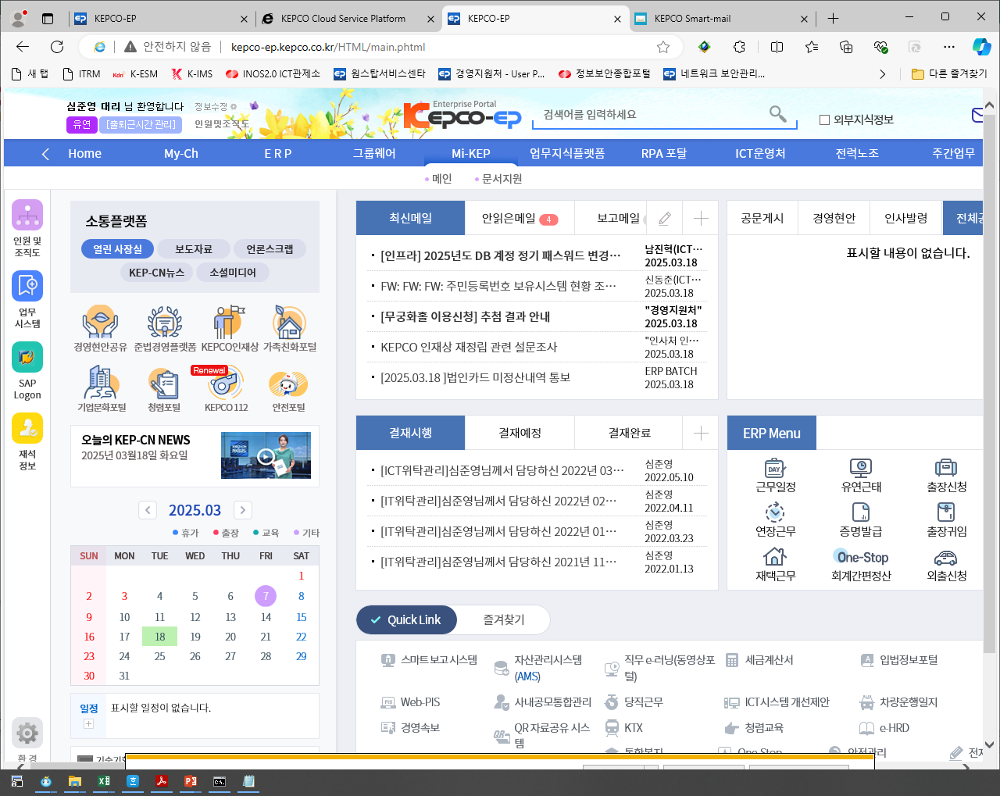
03

04

05
보정계수 적용
평가유형 설정
경계설정
기능산정
개발비 산정
데이터 기능
트랜잭션 기능
대상 및 범주 설정
비기능 요구사항 반영
Application 경계
측정 범위 경계
대상시스템(숙소관리시스템)

직원정보
직원정보조회

경계 밖의 타 시스템
(인사시스템)
입주자 직원 등록

EI
숙소 거주자 정보

23

### Notes:
3. 기능점수 산정 절차
3.1. 기능점수 산정 절차
3.1.2. 애플리케이션 경계 설정

<!-- Slide number: 24 -->
기능점수 산정 절차 및 방법 (간이법 기준)

★
기능점수 산정 절차

01

02

03

04

05
보정계수 적용
평가유형 설정
경계설정
기능산정
개발비 산정
데이터 기능
트랜잭션 기능
대상 및 범주 설정
비기능 요구사항 반영
트랜잭션 기능 산정
데이터기능 산정

- 트랜잭션을 발생시키거나 그로인해 변경되는 데이터 그룹 단위
 - 트랜잭션 기능이 참고하는 데이터 셋
 - 요구사항에 정의된 (논리적인)데이터셋을 의미
 - ILF, EIF로 구분
데이터 처리를 위한 CRUD가 발생되는 기능 단위
정의된 데이터 기능에 CRUD를 발생시키는 기능을 의미
EI, EO, EQ로 구분
[바]
기능점수 산정
[다]
식별규칙검증
[라]
복잡도 산정
[마]
가중치 적용
[가]
기능식별
[나]
기능유형구분
(간이법) 평균복잡도
(정통법) 개별복잡도

24

### Notes:
3. 기능점수 산정 절차
3.1. 기능점수 산정 절차
3.1.3. 기능산정

<!-- Slide number: 25 -->
기능점수 산정 절차 및 방법 (간이법 기준)

기능산정 - 기능식별
[바]
기능점수 산정
[다]
식별규칙검증
[라]
복잡도 산정
[마]
가중치 적용
[가]
기능식별
[나]
기능유형구분
○ 단위기능 식별 방법
| 구분 | 설 명 | 참고 대상 |
| --- | --- | --- |
| 개발사업 | ○ SW(단위시스템)의 설계 당시, 정의된 요구사항을 기초로 각 단위기능을 정의 | 요구사항정의서, RFI 등 → 단위기능정의 |
| 유지보수사업 | ○ 유지보수 대상 시스템에서 운영 중인 단위기능을 정의 (→유지관리 사업 대상의 단위기능 명세) | 운영기능(직접 접근) → 단위기능정의 |

25

### Notes:
3. 기능점수 산정 절차
3.1. 기능점수 산정 절차
3.1.3. 기능산정
3.1.3.1. 기능식별

<!-- Slide number: 26 -->
기능점수 산정 절차 및 방법 (간이법 기준)

기능산정 - 기능식별
[바]
기능점수 산정
[다]
식별규칙검증
[라]
복잡도 산정
[마]
가중치 적용
[가]
기능식별
[나]
기능유형구분

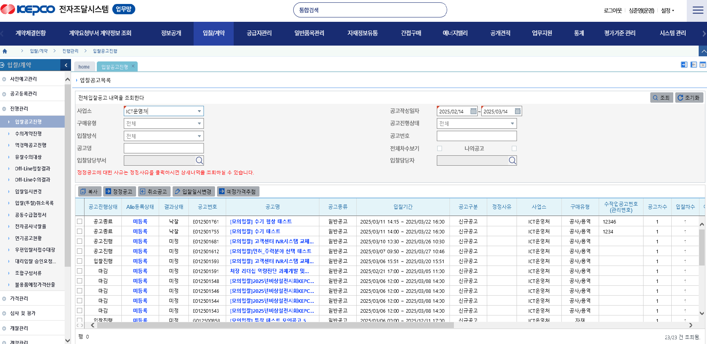
○ 트랜잭션 기능 식별

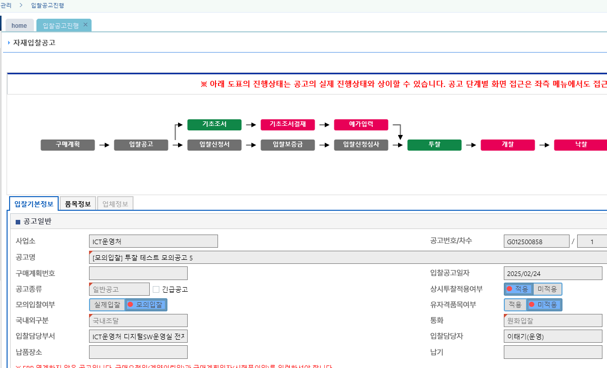
| 단위기능명 | CRUD | 기능유형 | 참조데이터기능 |
| --- | --- | --- | --- |
| 입찰공고목록 내역 조회 | R |  | 공고정보 |
| 입찰공고 상세정보 조회 | R |  | 공고정보 |
○데이터 기능 식별
| 단위기능명 | 기능유형 | 비고 |
| --- | --- | --- |
| 공고 정보 내부논리파일 |  |  |
|  |  |  |

26

### Notes:
3. 기능점수 산정 절차
3.1. 기능점수 산정 절차
3.1.3. 기능산정
3.1.3.1. 기능식별

<!-- Slide number: 27 -->
기능점수 산정 절차 및 방법 (간이법 기준)

★
[참고] CRUD 및 CRUD Metrix
C    R    U    D

reate
ead
pdate
elete
삭제
EI : External Input
수정
EI : External Input
쓰기(등록)
EI : External Input
읽기
EQ(조회) : External Query
EO(출력) : External Out
컴퓨터 소프트웨어가 갖는 기본적인 데이터 처리 기능
 - DBMS에서 데이터가 입출력되는 작업을 4개로 축약
 - DML의 4개 동작 (insert, update, delete, select)
[CRUD Metrix]

27

### Notes:
CRUD

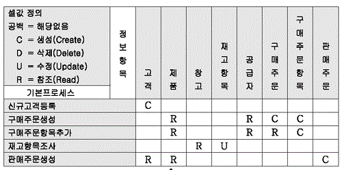
<!-- Slide number: 28 -->
기능점수(Function Point / FP)

★
기능산정 - 기능유형 구분
[바]
기능점수 산정
[다]
식별규칙검증
[라]
복잡도 산정
[마]
가중치 적용
[가]
기능식별
[나]
기능유형구분
트랜잭션 기능
데이터기능
EI
외부입력
EQ
외부조회
EO
외부출력
ILF
내부논리파일
EIF
외부연계파일
입력 수정 삭제
출력
내부데이터
조회
연계 데이터
(단순복제 포함)
7.5
5.4
5.2
4.0
3.9

28

### Notes:
3. 기능점수 산정 절차
3.1. 기능점수 산정 절차
3.1.3. 기능산정
3.1.3.2. 기능유형 구분

<!-- Slide number: 29 -->
기능점수(Function Point / FP)

트랜잭션 이란?
컴퓨터로 처리되는 작업의 단위

하나의 작업을 수행하기 위한 데이터베이스 연산의 모음

데이터처리에 대한 하나의 논리적 단위

계좌이체라는 하나의 작업단위
 ① 보내는 사람 통장에서 인출
 ② 받는 사람 통장에 입금

계좌이체 트랜잭션
   Update 계좌
   Set 잔액=잔액-5000
   Where 계좌번호=100;

   Update 계좌
   Set 잔액 = 잔액+5000
   Where 계좌번호=200;
변경 전

100 : 5000원
200 : 5000원
변경 후
 100 : 0원
200 : 10000원
→ ②까지 정상적으로 끝나면 commit.
    둘 중 하나라도 되지 않으면 rollback.

29

### Notes:
[참고] 트랜잭션 이란?

<!-- Slide number: 30 -->
기능점수 산정 절차 및 방법 (간이법 기준)

기능산정 - 기능유형 구분
[바]
기능점수 산정
[다]
식별규칙검증
[라]
복잡도 산정
[마]
가중치 적용
[가]
기능식별
[나]
기능유형구분
○ 트랜잭션기능 유형 구분
| 유형 | 설 명 | 참고 |
| --- | --- | --- |
| EI | ㆍ외부입력(External Input) / 4.0 ㆍ애플리케이션 경계 밖에서 들어오는 데이터나 제어정보를 처리하는 단위프로세스 하나 이상의 논리파일을 변경하거나 시스템 동작(CRUD 중, CUD)을 변경하는 단위프로세스 | 입력, 수정, 삭제 |
| EQ | ㆍ외부조회(External Query) / 3.9 ㆍ데이터나 제어정보를 애플리케이션을 통해 보여주는 단위프로세스 계산, 파생데이터, 시스템 동작 변경 등이 없는 단순 조회(CRUD 중, R)만을 수행하는 단위프로세스 | 조회(단순) (단순 select) |
| EO | ㆍ외부출력(External Output) / 5.2 ㆍ외부조회에 추가적인 처리 로직을 포함하여 데이터나 제어정보를 보여주는 단위 프로세스 | 조회 (가공정보 생성) (EQ결과의 통계값 등) |

30

### Notes:
3. 기능점수 산정 절차
3.1. 기능점수 산정 절차
3.1.3. 기능산정
3.1.3.2. 기능유형 구분
3.1.3.2.1. 트랜잭션기능 유형 구분

<!-- Slide number: 31 -->
기능점수 산정 절차 및 방법 (간이법 기준)

★
기능산정 - 기능유형 구분
[바]
기능점수 산정
[다]
식별규칙검증
[라]
복잡도 산정
[마]
가중치 적용
[가]
기능식별
[나]
기능유형구분
○ 트랜잭션기능 유형 구분방식 (1/2)
트랜잭션 기능
C    R    U    D

N
N
수정
(U/Update)
삭제
(D/Delete)
N
화면조회
(R/Select)
신규등록
(C/Input)
reate
ead
pdate
elete
삭제
EI : External Input
Y
Y
Y
Y
수정
EI : External Input
쓰기(등록)
EI : External Input

N
파생데이터
읽기
EQ(조회) : External Query
EO(출력) : External Out
Y
CRUD 발생에 따라 EI/EO/EQ로 식별
EQ
(조회)
EO
(출력)
EI
(입력)
EI
(수정)
EI
(삭제)

31

### Notes:
3. 기능점수 산정 절차
3.1. 기능점수 산정 절차
3.1.3. 기능산정
3.1.3.2. 기능유형 구분
3.1.3.2.2. 트랜잭션기능 유형 구분방식

<!-- Slide number: 32 -->
기능점수 산정 절차 및 방법 (간이법 기준)

★
기능산정 - 기능유형 구분
[바]
기능점수 산정
[다]
식별규칙검증
[라]
복잡도 산정
[마]
가중치 적용
[가]
기능식별
[나]
기능유형구분
○ 트랜잭션기능 유형 구분방식 (2/2)
EQ
애플리케이션 범위 밖으로 데이터나 제어 정보를 보내는 단위 프로세스
논리파일로부터 데이터나 제어 정보를 검색함
수학 공식이나 측정을 포함하지 않음
파생 데이터를 만들지 않음
내부논리파일을 유지하지 않음 (변경하지 않음)
시스템의 동작을 변경하지 않음
EO
EQ에 파생데이터 생성
 - 그래프, 통계, 합산 등
애플리케이션 경계를 통해 들어온 데이터가 시스템의 동작을 바꾸는 경우, 적어도 하나의 ILF 를 유지해야 함
 (단, 제어정보일 경우에는 단독 산정 가능)
사용자에 의해 애플리케이션 경계 밖에서 데이터를 입력하여 ILF를 유지하므로 EI 로 식별
EI

32

### Notes:
3. 기능점수 산정 절차
3.1. 기능점수 산정 절차
3.1.3. 기능산정
3.1.3.2. 기능유형 구분
3.1.3.2.2. 트랜잭션기능 유형 구분방식

<!-- Slide number: 33 -->
기능점수 산정 절차 및 방법 (간이법 기준)

★
[참고] 트랜잭션기능 유형 구분 시, 참고사항
(※ 사내한정)

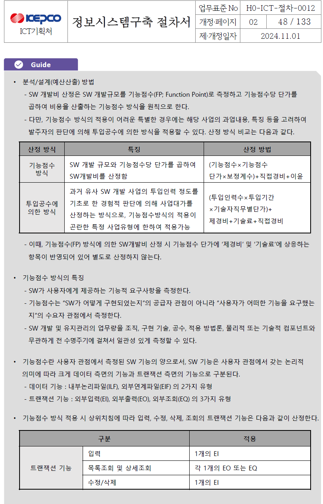
S/W 개발비 산정방식 표준화 시행 알림
[전력(시)19406-4(2010.01.04)

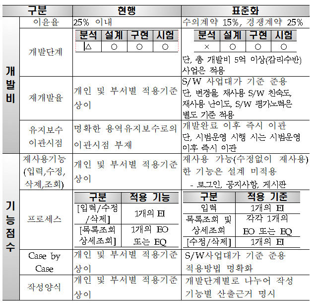

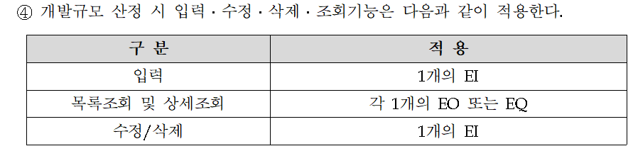

33

### Notes:
[참고] 트랜잭션 기능 유형 구분 시, 참고사항 (사내한정)

<!-- Slide number: 34 -->
기능점수 산정 절차 및 방법 (간이법 기준)

기능산정 - 기능유형 구분
[바]
기능점수 산정
[다]
식별규칙검증
[라]
복잡도 산정
[마]
가중치 적용
[가]
기능식별
[나]
기능유형구분

○ 트랜잭션 기능 유형 구분

| 단위기능명 | CRUD | 기능유형 | 참조데이터기능 |
| --- | --- | --- | --- |
| 입찰공고목록 내역 조회 | R | EQ | 공고정보 |
| 입찰공고 상세정보 조회 | R | EQ | 공고정보 |
○데이터 기능 유형 구분
| 단위기능명 | 기능유형 | 비고 |
| --- | --- | --- |
| 공고 정보 내부논리파일 |  |  |
|  |  |  |

34

### Notes:
3. 기능점수 산정 절차
3.1. 기능점수 산정 절차
3.1.3. 기능산정
3.1.3.2. 기능유형 구분
3.1.3.2.2. 트랜잭션기능 유형 구분방식

<!-- Slide number: 35 -->
기능점수 산정 절차 및 방법 (간이법 기준)

★
기능산정 - 기능유형 구분
[바]
기능점수 산정
[다]
식별규칙검증
[라]
복잡도 산정
[마]
가중치 적용
[가]
기능식별
[나]
기능유형구분
 배치작업의 경우 어떻게 산정 하는지??  (→하나의 트랜잭션을 위해 여러 step을 거치는 일반기능도 동일)

배치작업 간 진행되는 각 단계(Step)을 기능으로 산정하지 않으며,
비즈니스상 가치 있는 ITO(Input Tech Output)가 수행되는 Job을 1개의 기능으로 산정함.
1 JOB
| Job | 하나의 Input으로부터 비즈니스상 가치있는 Output이 나오는 Process |
| --- | --- |
| Step | 하나의 Job 수행을 위해 절차적으로 수행되는 단위 Process (해당 작업으로 나오는 Output이 비즈니스상 가치있는 데이터로 완결이 나지 않을 경우) |

1Step
3Step
2Step

35

### Notes:
3. 기능점수 산정 절차
3.1. 기능점수 산정 절차
3.1.3. 기능산정
3.1.3.2. 기능유형 구분
3.1.3.2.2. 트랜잭션기능 유형 구분방식
3.1.3.2.3.1. 배치작업 산정 기준

<!-- Slide number: 36 -->
기능점수 산정 절차 및 방법 (간이법 기준)

기능산정 - 기능유형 구분
[바]
기능점수 산정
[다]
식별규칙검증
[라]
복잡도 산정
[마]
가중치 적용
[가]
기능식별
[나]
기능유형구분
○ 데이터기능 유형 구분     ※ 사용자 관점에서 정의된 논리적 데이터 단위로 구분!!  → 테이블 단위가 아님
| 유형 | 설 명 | 비고 |
| --- | --- | --- |
| ILF | ㆍ내부논리파일(In Logical File) / 7.5 ㆍ사용자 관점에서 식별 가능한 논리적인 데이터 그룹 중, 대상 애플리케이션 내부에서 유지되는 항목 (→해당 단위시스템의 논리데이터셋을 정의) | 7.5 |
| EIF | ㆍ외부인터페이스파일(External Interface File) / 5.4 ㆍ사용자 관점에서 식별 가능한 논리적인 데이터 그룹 중, 대상 애플리케이션에서 참조되지만 데이터 유지는 타 시스템에서 진행되는 항목 (→타 시스템 또는 타 기관 데이터 연계 등) | 5.4 |

36

### Notes:
3. 기능점수 산정 절차
3.1. 기능점수 산정 절차
3.1.3. 기능산정
3.1.3.2. 기능유형 구분
3.1.3.2.3. 데이터기능 유형 구분

<!-- Slide number: 37 -->
기능점수 산정 절차 및 방법 (간이법 기준)

★
기능산정 - 기능유형 구분
[바]
기능점수 산정
[다]
식별규칙검증
[라]
복잡도 산정
[마]
가중치 적용
[가]
기능식별
[나]
기능유형구분
|  | EI | EO | EQ |
| --- | --- | --- | --- |
| ILF | ○ | ○ | ○ |
| EIF | x | ○ | ○ |
데이터 기능

N
ILF
내부논리파일
N
Y
N
타 시스템 데이터
업무 정의 데이터
코드성 데이터
임시 테이블
Y
Y
Y
N
Y

EI 지원
산정제외
EIF
외부연계파일
N

37

### Notes:
3. 기능점수 산정 절차
3.1. 기능점수 산정 절차
3.1.3. 기능산정
3.1.3.2. 기능유형 구분
3.1.3.2.4. 데이터기능 유형 구분 방식

<!-- Slide number: 38 -->
기능점수 산정 절차 및 방법 (간이법 기준)

★
기능산정 - 기능유형 구분
[바]
기능점수 산정
[다]
식별규칙검증
[라]
복잡도 산정
[마]
가중치 적용
[가]
기능식별
[나]
기능유형구분
○ 데이터기능 유형 구분 방식
 # 산정 대상 시스템에서 생성/관리되는 내부 데이터일 경우, ILF로 정의
 # 산정에서 제외되는 경우..
    - 사용자 관점에서 식별 불가한 데이터, 비즈니스 데이터가 아닌 경우에는 제외(업무 외의 데이터 제외)
    - (예) <접속로그>, <시스템성능관리데이터>, <코드성데이터>, <임시테이블>
ILF
 # 타 시스템, 타 기관과의 연계 데이터일 경우, EIF로 정의 (→ 내 시스템에 복제한 테이블도 단순 복제라면 EIF!!!)
 # 타 시스템 데이터가 ILF가 될 수 있는 경우
    - 산정 대상 시스템의 경계와 다르지만(EIF이지만), EI가 발생하면 ILF로 정의     [별도 설명**]
       (→ EIF를 참조하는 트랜잭션 기능은 EO, EQ만 존재)
EIF

38

### Notes:
3. 기능점수 산정 절차
3.1. 기능점수 산정 절차
3.1.3. 기능산정
3.1.3.2. 기능유형 구분
3.1.3.2.4. 데이터기능 유형 구분 방식

<!-- Slide number: 39 -->
기능점수 산정 절차 및 방법 (간이법 기준)

★
기능산정 - 기능유형 구분
[바]
기능점수 산정
[다]
식별규칙검증
[라]
복잡도 산정
[마]
가중치 적용
[가]
기능식별
[나]
기능유형구분
 코드성 데이터 식별 방법

 # 다음 중 하나라도 포함될 경우…
    - 키, 이름, 약어 등과 같은 소수의 속성으로 구현되어 레코드가 제한적이며, 사용자에 의한 변경이 거의 발생하지 않는 데이터
       (프로그램 성능, 로직 구현 등을 위해 개발 시 구성된 데이터)
    - 주소, 담당자연락처, 양식데이터, 산업분류코드 등과 하드코딩 되어도 무관한 데이터

  ※ 공고번호, 고객번호 등 업무 요구사항 상 필요하고 지속 발생/변경되는 데이터의 경우는 코드성 데이터가 아님.

39

### Notes:
3. 기능점수 산정 절차
3.1. 기능점수 산정 절차
3.1.3. 기능산정
3.1.3.2. 기능유형 구분
3.1.3.2.4. 데이터기능 유형 구분 방식
3.1.3.2.4.1. 코드성데이터 식별 방법

<!-- Slide number: 40 -->
기능점수 산정 절차 및 방법 (간이법 기준)

★
기능산정 - 기능유형 구분
[바]
기능점수 산정
[다]
식별규칙검증
[라]
복잡도 산정
[마]
가중치 적용
[가]
기능식별
[나]
기능유형구분
 경계 밖의 데이터 기능이 EIF가 ILF가 되는 경우

|  | ㆍ대상시스템 : 숙소관리시스템 ㆍ대상데이터 : 직원정보 외부인터페이스파일 | → EIF |
| --- | --- | --- |
|  | ㆍ대상시스템 : 숙소관리시스템 ㆍ대상데이터 : 급여공제정보 내부논리파일 | → ILF |

40

### Notes:
3. 기능점수 산정 절차
3.1. 기능점수 산정 절차
3.1.3. 기능산정
3.1.3.2. 기능유형 구분
3.1.3.2.4. 데이터기능 유형 구분 방식
3.1.3.2.4.2. 경계밖의 데이터 기능이 EIF가 아닌 ILF가 되는 경우

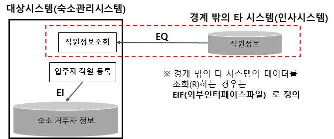
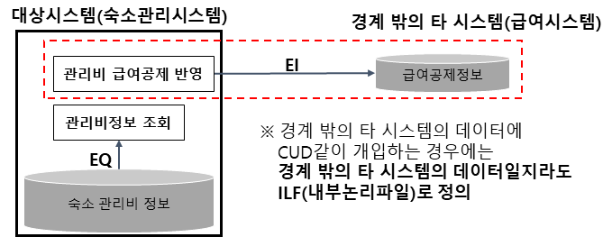
<!-- Slide number: 41 -->
기능점수 산정 절차 및 방법 (간이법 기준)

기능산정 - 기능유형 구분
[바]
기능점수 산정
[다]
식별규칙검증
[라]
복잡도 산정
[마]
가중치 적용
[가]
기능식별
[나]
기능유형구분

○ 트랜잭션 기능 유형 구분

| 단위기능명 | 기능유형 | 참조데이터기능 |
| --- | --- | --- |
| 입찰공고목록 내역 조회 | EQ | 공고정보 |
| 입찰공고 상세정보 조회 | EQ | 공고정보 |
○데이터 기능 유형 구분
| 단위기능명 | 기능유형 | 비고 |
| --- | --- | --- |
| 공고 정보 내부논리파일 | ILF |  |
| [[외부가 있다면??]] | EIF | 시스템명 |

41

### Notes:
3. 기능점수 산정 절차
3.1. 기능점수 산정 절차
3.1.3. 기능산정
3.1.3.2. 기능유형 구분
3.1.3.2.4. 데이터기능 유형 구분 방식

<!-- Slide number: 42 -->
기능점수 산정 절차 및 방법 (간이법 기준)

★
기능산정 – 식별규칙 검증
[바]
기능점수 산정
[다]
식별규칙검증
[라]
복잡도 산정
[마]
가중치 적용
[가]
기능식별
[나]
기능유형구분
○ 식별 규칙 검증
하나의 트랜잭션 기능은 하나 이상의 데이터 기능을 참조한다
 - [나] 에서 식별/정의한 기능의 적정성 검증
트랜잭션이 발생하지 않는 데이터 기능은 없다
(데이터기능만 단독으로 있을 수 없다)

| 단위기능명 | 기능유형 | 참조데이터기능 |
| --- | --- | --- |
| 입찰공고목록 내역 조회 | EQ | 공고정보 |
| 입찰공고 상세정보 조회 | EQ | 공고정보 |
| 공고정보 내부논리파일 | ILF |  |
사용자가 인식하는 기능만이 기능으로 정의될 수 있다
(단, 요구사항으로 명시된 관리자용 기능은 정의)
상용 솔루션으로 구현된 기능은 기능으로 산정하지 않는다 (OZ리포트, ESB 연계 등)
조건으로 분기되는 조회화면은 하나만 산정한다
(경기/강원/서울 설비현황.. 과 같이 따로 산정 안함)

42

### Notes:
3. 기능점수 산정 절차
3.1. 기능점수 산정 절차
3.1.3. 기능산정
3.1.3.3. 식별규칙 검증

<!-- Slide number: 43 -->
기능점수 산정 절차 및 방법 (간이법 기준)

★
기능산정 – 식별규칙 검증
[바]
기능점수 산정
[다]
식별규칙검증
[라]
복잡도 산정
[마]
가중치 적용
[가]
기능식별
[나]
기능유형구분
무엇(What)
어떻게(How)
무엇(What)
어떻게(How)
을
을
조회(EQ/EO)
요금제 단가정보
등록 (EI)
전기요금 데이터
전기요금 청구서 발행
수정 (EI)
고객정보
(사용량 등)
삭제 (EI)
하나의 트랜잭션 기능은 하나 이상의 데이터 기능을 참조한다. / 트랜잭션이 발생하지 않는 데이터 기능은 없다.

43

### Notes:
3. 기능점수 산정 절차
3.1. 기능점수 산정 절차
3.1.3. 기능산정
3.1.3.3. 식별규칙 검증

<!-- Slide number: 44 -->
기능점수 산정 절차 및 방법 (간이법 기준)

★
기능산정 - 데이터기능 산정
[바]
기능점수 산정
[다]
식별규칙검증
[라]
복잡도 산정
[마]
가중치 적용
[가]
기능식별
[나]
기능유형구분
○ 복잡도 산정
| 간이법 | 정통법 |
| --- | --- |
| 평균복잡도 적용 | 개별복잡도 적용 각 기능별로 RET(레코드요소유형) 및 DET(데이터요소유형)을 산정 |

44

### Notes:
3. 기능점수 산정 절차
3.1. 기능점수 산정 절차
3.1.3. 기능산정
3.1.3.4. 복잡도 산정

<!-- Slide number: 45 -->
기능점수 산정 절차 및 방법 (간이법 기준)

기능산정 - 데이터기능 산정
[바]
기능점수 산정
[다]
식별규칙검증
[라]
복잡도 산정
[마]
가중치 적용
[가]
기능식별
[나]
기능유형구분
○ 트랜잭션 기능
○ 데이터기능

| 구분 | 간이법 | 정통법 |
| --- | --- | --- |
| EI | 4.0 |  |
| EO | 5.2 |  |
| EQ | 3.9 |  |
| 구분 | 간이법 | 정통법 |
| --- | --- | --- |
| ILF | 7.5 |  |
| EIF | 5.4 |  |

45

### Notes:
3. 기능점수 산정 절차
3.1. 기능점수 산정 절차
3.1.3. 기능산정
3.1.3.4. 복잡도 산정

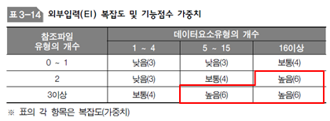
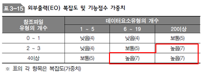
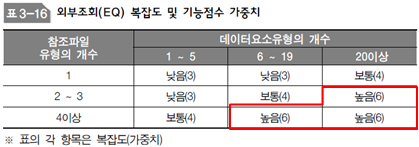
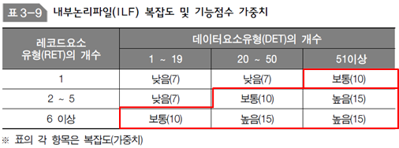
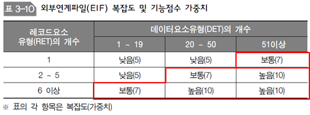
<!-- Slide number: 46 -->
기능점수 산정 절차 및 방법 (간이법 기준)

기능산정 - 데이터기능 산정
[바]
기능점수 산정
[다]
식별규칙검증
[라]
복잡도 산정
[마]
가중치 적용
[가]
기능식별
[나]
기능유형구분

○ 기능 유형에 따라 해당하는 가중치(점수) 부여

| 단위기능명 | 기능유형 | 점 수 | 참조데이터기능 |
| --- | --- | --- | --- |
| 입찰공고목록 내역 조회 | EQ | 3.9 | 공고정보 |
| 입찰공고 상세정보 조회 | EQ | 3.9 | 공고정보 |
| 공고 정보 내부논리파일 | ILF | 7.5 |  |

46

### Notes:
3. 기능점수 산정 절차
3.1. 기능점수 산정 절차
3.1.3. 기능산정
3.1.3.5. 가중치 적용

<!-- Slide number: 47 -->
기능점수 산정 절차 및 방법 (간이법 기준)

기능산정 - 데이터기능 산정
[바]
기능점수 산정
[다]
식별규칙검증
[라]
복잡도 산정
[마]
가중치 적용
[가]
기능식별
[나]
기능유형구분
보정 전
개발원가 산정
산정한 단위기능별 점수 합산
| 단위기능명 | 기능유형 | 점 수 | 참조데이터기능 |
| --- | --- | --- | --- |
| 입찰공고목록 내역 조회 | EQ | 3.9 | 공고정보 |
| 입찰공고 상세정보 조회 | EQ | 3.9 | 공고정보 |
| 공고 정보 내부논리파일 | ILF | 7.5 |  |
[산정규모] × FP당 단가
  = 15.3× 605,784원
15.3FP

47

### Notes:
3. 기능점수 산정 절차
3.1. 기능점수 산정 절차
3.1.3. 기능산정
3.1.3.6. 기능점수 산정

<!-- Slide number: 48 -->
기능점수 산정 절차 및 방법 (간이법 기준)

★
[참고] FP당 단가 / 단계별 가중치

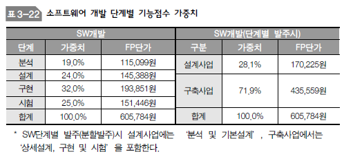

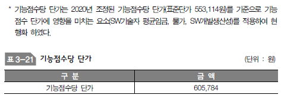

출처 : 소프트웨어사업대가산정가이드
         (2024년 개정판, 한국소프트웨어산업협회)

48

### Notes:
[참고] FP당 단가  (2024년 소프트웨어 사업 대가산정 가이드)

<!-- Slide number: 49 -->

기능산정
요약구간

### Notes:
쉬는페이지

<!-- Slide number: 50 -->
요약

★
기능산정 – 빠르게 다시보기
[바]
기능점수 산정
[다]
식별규칙검증
[라]
복잡도 산정
[마]
가중치 적용
[가]
기능식별
[나]
기능유형구분

○ 트랜잭션 기능 식별

| 단위기능명 | 기능유형 | 참조데이터기능 |
| --- | --- | --- |
| 입찰공고목록 내역 조회 |  | 공고정보 |
| 입찰공고 상세정보 조회 |  | 공고정보 |
○데이터 기능 식별
| 단위기능명 | 기능유형 | 비고 |
| --- | --- | --- |
| 공고 정보 내부논리파일 |  |  |
|  |  |  |

50

### Notes:
요약(핵심)
 - 여기만 제대로 하면

<!-- Slide number: 51 -->
요약

★
기능산정 – 빠르게 다시보기
[바]
기능점수 산정
[다]
식별규칙검증
[라]
복잡도 산정
[마]
가중치 적용
[가]
기능식별
[나]
기능유형구분

| 단위기능명 | 기능유형 | 점 수 | 참조데이터기능 |
| --- | --- | --- | --- |
| 입찰공고목록 내역 조회 | EQ | 3.9 | 공고정보 |
| 입찰공고 상세정보 조회 | EQ | 3.9 | 공고정보 |
| 공고 정보 내부논리파일 | ILF | 7.5 |  |

[산정규모] × FP당 단가
  = 15.3FP× 605,784원

51

### Notes:
요약(핵심)
 - 나머지는 자동화

<!-- Slide number: 52 -->
요약

★
기능목록 작성 요령 (운영시스템 기준)

트랜잭션-데이터기능 매핑
기능유형 식별
단위기능별 유형 식별 (CRUD)
메뉴-단위기능별
데이터기능 작성
전체 메뉴 작성
(레벨별 작성)
각 화면명 작성
(단위기능)
데이터기능 작성하기
트랜잭션기능 작성하기
③
①
②

| 대메뉴 | 중메뉴 | 소메뉴 | 단위기능명 | CRUD | 기능유형 | 참조데이터기능 |
| --- | --- | --- | --- | --- | --- | --- |
| 입찰/계약 | 공고등록관리 |  | 공고등록(자재구매) | C |  | 입찰공고정보 내부논리파일 |
|  | 공고등록관리 |  | 공고등록(공사용역) | C |  | 입찰공고정보 내부논리파일 |
|  | 공고등록관리 |  | 수의공고 등록 | C |  | 입찰공고정보 내부논리파일 |
|  |  |  |  |  |  |  |
|  | 진행관리 | 입찰공고진행 | 입찰공고 목록 조회 | R |  |  |
|  | 진행관리 | 입찰공고진행 | 공사용역 입찰공고 상세조회 | R |  |  |
|  | 진행관리 | 입찰공고진행 | 자재구매 입찰공고 상세조회 | R |  |  |
|  | 진행관리 | 입찰공고진행 | 정정공고 | U |  |  |
|  | 진행관리 | 입찰공고진행 | 취소공고 | U |  |  |

52

### Notes:
운영시스템 작성 요령

<!-- Slide number: 53 -->
요약

★
기능목록 작성 요령 (운영시스템 기준)

트랜잭션-데이터기능 매핑
기능유형 식별
단위기능별 유형 식별 (CRUD)
메뉴-단위기능별
데이터기능 작성
전체 메뉴 작성
(레벨별 작성)
각 화면명 작성
(단위기능)
트랜잭션기능
데이터기능
⑥
⑤

| 대메뉴 | 중메뉴 | 소메뉴 | 단위기능명 | CRUD | 기능유형 | 참조데이터기능 |
| --- | --- | --- | --- | --- | --- | --- |
| 입찰/계약 | 공고등록관리 |  | 공고등록(자재구매) | C | EI | 입찰공고정보 내부논리파일 |
|  | 공고등록관리 |  | 공고등록(공사용역) | C | EI | 입찰공고정보 내부논리파일 |
|  | 공고등록관리 |  | 수의공고등록 | C | EI | 입찰공고정보 내부논리파일 |
|  | 공고등록관리 |  | 입찰공고정보 내부논리파일 | 데이터 | ILF |  |
|  | 진행관리 | 입찰공고진행 | 입찰공고 목록 조회 | R | EQ |  |
|  | 진행관리 | 입찰공고진행 | 공사용역 입찰공고 상세조회 | R | EQ |  |
|  | 진행관리 | 입찰공고진행 | 자재구매 입찰공고 상세조회 | R | EQ |  |
|  | 진행관리 | 입찰공고진행 | 정정공고 | U | EI |  |
|  | 진행관리 | 입찰공고진행 | 취소공고 | U | EI |  |
④

53

### Notes:
운영시스템 작성 요령

<!-- Slide number: 54 -->

기능산정
요약구간 (끝)

### Notes:
쉬는페이지

<!-- Slide number: 55 -->
기능점수 산정 절차 및 방법 (간이법 기준)

★
기능점수 산정 절차

01

02

03

04

05
보정계수 적용
평가유형 설정
경계설정
기능산정
개발비 산정
데이터 기능
트랜잭션 기능
대상 및 범주 설정
비기능 요구사항 반영
애플리케이션 복잡도 보정계수
규모보정계수

사용자가 애플리케이션에 요구하는 복잡도 수준
비기능 요구사항
- 소프트웨어개발사업의 생산성 변화를 고려한 보정계수
- 개발사업 규모에 따라 생산성이 점진적으로 증가하나,
   일정규모 이상부터는 생산성이 다시 감소하는 점을 보정
연계복잡도 수준
보안성
수준
성능요구
수준
운영환경
호환성

55

### Notes:
3. 기능점수 산정 절차
3.1. 기능점수 산정 절차
3.1.4. 보정계수 적용

<!-- Slide number: 56 -->
기능점수 산정 절차 및 방법 (간이법 기준)

기능점수 산정 절차

01

02

03

04

05
보정계수 적용
평가유형 설정
경계설정
기능산정
개발비 산정
데이터 기능
트랜잭션 기능
대상 및 범주 설정
비기능 요구사항 반영
규모보정계수

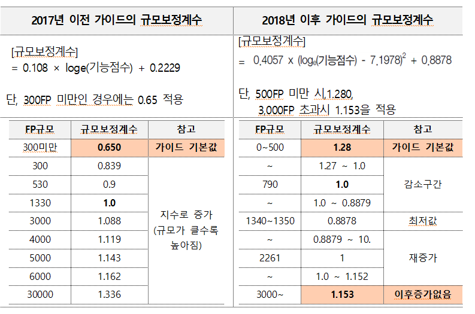

- 소프트웨어개발사업의 생산성 변화를 고려한 보정계수
- 개발사업 규모에 따라 생산성이 점진적으로 증가하나,
   일정규모 이상부터는 생산성이 다시 감소하는 점을 보정

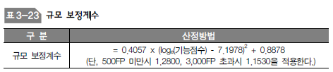
출처 : 소프트웨어사업대가산정가이드 (2024년 개정판, 한국소프트웨어산업협회)

56

### Notes:
3. 기능점수 산정 절차
3.1. 기능점수 산정 절차
3.1.4. 보정계수 적용
3.1.4.1. 규모보정계수

<!-- Slide number: 57 -->
기능점수 산정 절차 및 방법 (간이법 기준)

기능점수 산정 절차

01

02

03

04

05
보정계수 적용
평가유형 설정
경계설정
기능산정
개발비 산정
데이터 기능
트랜잭션 기능
대상 및 범주 설정
비기능 요구사항 반영
애플리케이션 복잡도 보정계수

# 대상 애플리케이션의 연계 기관수가 증가 (타 기관과의 연계)
    → 프로젝트 관리 복잡성 증가

연계복잡도 수준
보안성
수준
성능요구
수준
운영환경
호환성

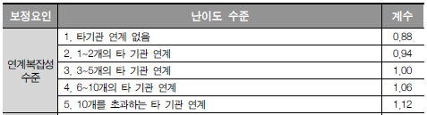
| 판정기준 | 연계 개수 | 산정 |
| --- | --- | --- |
| 타 기관 및 회사 시스템과의 연계 없음 | 0 | 0 |
| 한전 내부의 타 시스템과 연계 | 산정x | 0 |
| 타 기관 및 기업의 시스템과 연계가 존재함 | 해당 수량 기재 | N |
| 행공센(행정정보공동이용센터)를 통한 연계 | 1 | 1 |
출처 : 소프트웨어사업대가산정가이드 (2024년 개정판, 한국소프트웨어산업협회)

57

### Notes:
3. 기능점수 산정 절차
3.1. 기능점수 산정 절차
3.1.4. 보정계수 적용
3.1.4.2. 연계복잡도수준

<!-- Slide number: 58 -->
기능점수 산정 절차 및 방법 (간이법 기준)

기능점수 산정 절차

01

02

03

04

05
보정계수 적용
평가유형 설정
경계설정
기능산정
개발비 산정
데이터 기능
트랜잭션 기능
대상 및 범주 설정
비기능 요구사항 반영
애플리케이션 복잡도 보정계수

# 응답시간 또는 처리율에 대한 사용자 요구수준의 복잡성
  - 성능에 대한 명확한 요구사항이 있는지…
   (웹프로그램 8초 이내 로딩.. 등과 같은 단순 요구 x)
연계복잡도 수준
보안성
수준
성능요구
수준
운영환경
호환성

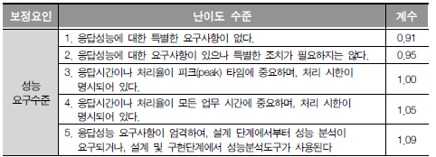
| 전제 | 상황 (모든 상황은 증빙 必) | 산정 |
| --- | --- | --- |
| 요구사항정의서 유지보수계획서 등에.. | 특별한 내용/기준 없음 | 1적용 |
|  | 응답성능(시간/처리율)이 명시 → 단순명시 | 2적용 |
|  | 응답성능(시간/처리율)이 명시 → 툭정피크타임 | 3적용 |
|  | 응답성능(시간/처리율)이 명시 → 업무시간 또는 24H | 4적용 |
|  | 개발 이후, 운영간 매분기/매월 성능분석 도구로 검증 요구 | 5적용 |
출처 : 소프트웨어사업대가산정가이드 (2024년 개정판, 한국소프트웨어산업협회)

58

### Notes:
3. 기능점수 산정 절차
3.1. 기능점수 산정 절차
3.1.4. 보정계수 적용
3.1.4.3. 성능요구 수준

<!-- Slide number: 59 -->
기능점수 산정 절차 및 방법 (간이법 기준)

기능점수 산정 절차

01

02

03

04

05
보정계수 적용
평가유형 설정
경계설정
기능산정
개발비 산정
데이터 기능
트랜잭션 기능
대상 및 범주 설정
비기능 요구사항 반영
애플리케이션 복잡도 보정계수

# 응용SW의 설치 운영환경이 상이한 정도
 → 상이한 플랫폼(하드웨어, 상용SW 등)을 지원하도록 개발

연계복잡도 수준
보안성
수준
성능요구
수준
운영환경
호환성

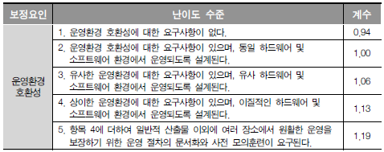
| 구분 | 산정 기준 | 비고 |
| --- | --- | --- |
| 없음 |  | 모든내용은 증빙 必 (유지보수계획서 등) |
| 동일한 | 동일 환경의 이중화 구성(HA솔루션, RAC 등) |  |
| 유사한 |  |  |
| 이질적인 | 상이한 OS환경(Unix, x86)에 이기종WAS, 이기종DBMS 적용 |  |
|  |  |  |
출처 : 소프트웨어사업대가산정가이드 (2024년 개정판, 한국소프트웨어산업협회)

59

### Notes:
3. 기능점수 산정 절차
3.1. 기능점수 산정 절차
3.1.4. 보정계수 적용
3.1.4.4. 운영환경 호환성

<!-- Slide number: 60 -->
기능점수 산정 절차 및 방법 (간이법 기준)

기능점수 산정 절차

01

02

03

04

05
보정계수 적용
평가유형 설정
경계설정
기능산정
개발비 산정
데이터 기능
트랜잭션 기능
대상 및 범주 설정
비기능 요구사항 반영
애플리케이션 복잡도 보정계수

# 시스템 보안에 대한 요구수준
   → 시큐어코딩, 웹취약점점검, 암호화점검, 개인정보보호 등
연계복잡도 수준
보안성
수준
성능요구
수준
운영환경
호환성

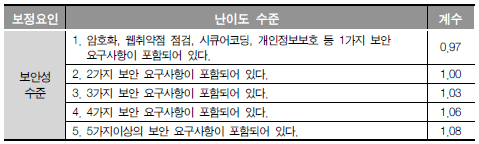
| 구분 | 산정 기준 | 비고 |
| --- | --- | --- |
| 암호화 | DB암호화가 적용된 컬럼이 존재할 경우 | 모든내용은 증빙 必 (유지보수계획서 등) |
| 시큐어코딩 | 개발시 또는 취약점조치 등의 시큐어코딩 소스가 존재함 |  |
| 개인정보보호 | 개인정보 암호화 및 익명성 등 시스템적으로 조치될 경우 (→패키지 사용시에도 적용함 / IPS, 웹방화벽 등 x) |  |
| 웹취약점점검 | 취약점 점검, 탐지, 조치의 3개 단계를 수행 (→정보보안처 취약점리포트의 조치는 불인정→1개단계수행) |  |
출처 : 소프트웨어사업대가산정가이드 (2024년 개정판, 한국소프트웨어산업협회)

60

### Notes:
3. 기능점수 산정 절차
3.1. 기능점수 산정 절차
3.1.4. 보정계수 적용
3.1.4.5. 보안성 수준

<!-- Slide number: 61 -->
기능점수 산정 절차 및 방법 (간이법 기준)

기능점수 산정 절차

01

02

03

04

05
보정계수 적용
평가유형 설정
경계설정
기능산정
개발비 산정
데이터 기능
트랜잭션 기능
대상 및 범주 설정
비기능 요구사항 반영

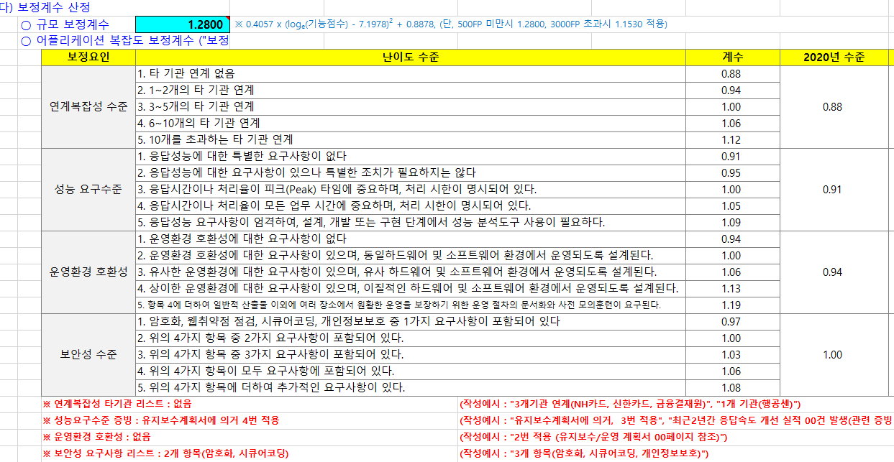

# 5개의 보정계수 산정 후,

# [보정 후 개발원가] 계산
   =  [보정 전 개발원가]
    ×  규모보정계수
    ×  연계복잡성 수준
    ×  성능요구 수준
    ×  운영환경 호환성
    ×  보안성 수준

61

### Notes:
3. 기능점수 산정 절차
3.1. 기능점수 산정 절차
3.1.4. 보정계수 적용

<!-- Slide number: 62 -->
기능점수 산정 절차 및 방법 (간이법 기준)

기능점수 산정 절차

01

02

03

04

05
보정계수 적용
평가유형 설정
경계설정
기능산정
개발비 산정
데이터 기능
트랜잭션 기능
대상 및 범주 설정
비기능 요구사항 반영
[개발비] = [(보정후)개발원가] + [직접경비] + [이윤]
| 개발원가 | 직접경비 | 이윤 |
| --- | --- | --- |
| [FP] × [FP당 단가 (553,111원)] × [보정계수 5종의 곱] | 개발사업 간 별도로 소요되는 ‘시스템 사용료’, ‘개발도구 사용료’ 등 | 개발원가의 25% 이내 (수의계약일 경우 15%, 경쟁계약지 25% 이내로 산정한다) |
※ FP방식에 의한 SW개발비 산정 시, 기능점수 단가에 ‘제경비‘ 및 ‘기술료＇에 상응하는 항목이 반영되어 있으므로 별도로 산정하지 않음

62

### Notes:
3. 기능점수 산정 절차
3.1. 기능점수 산정 절차
3.1.5. 개발비 산정

<!-- Slide number: 63 -->
기능점수 산정 절차 및 방법 (간이법 기준)

★
기능점수 산정 절차

01

02

03

04

05
보정계수 적용
평가유형 설정
경계설정
기능산정
개발비 산정
데이터 기능
트랜잭션 기능
대상 및 범주 설정
비기능 요구사항 반영
[개발비]
= [보정 후 개발원가] + 직접경비 + 이윤

[보정 후 개발원가]
= [보정 전 개발원가] × 규모보정계수 × 복잡도 보정계수 4종의 곱
[보정 전 개발원가]
= 산정된 시스템의 FP × FP당 단가

63

### Notes:
3. 기능점수 산정 절차
3.1. 기능점수 산정 절차
3.1.5. 개발비 산정

<!-- Slide number: 64 -->
기능점수 산정 절차 및 방법 (간이법 기준)

★
[참고] 이윤율 적용 관련 지침

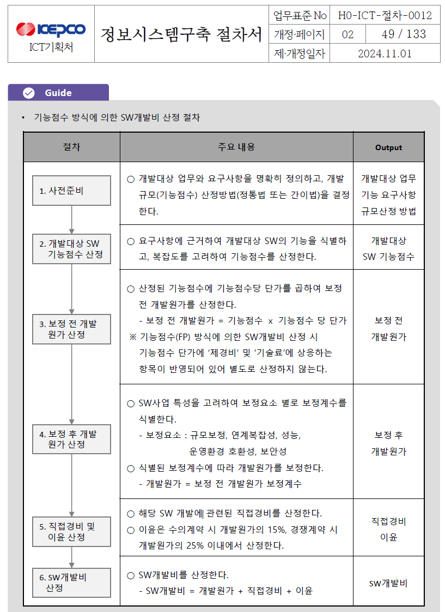

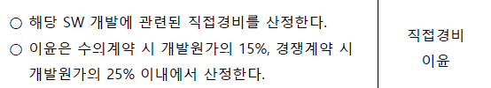

64

### Notes:
[참고] 이윤율 적용 관련 지침

<!-- Slide number: 65 -->

01 소프트웨어 대가산정

Contents
02 사용자 체감 기능 중심의 규모산정, 기능점수(Function Point)

03 기능점수 산정 절차 및 방법 (간이법)

04 주요 오산정 사례

05 실습

06 참고사항 (관련교육 등)

### Notes:

1
2
3
4
5

<!-- Slide number: 66 -->
주요 오산정 사례

검색조건에 따라 탭/시트/콤보박스  등으로 구분되어 있는 경우
조건분기

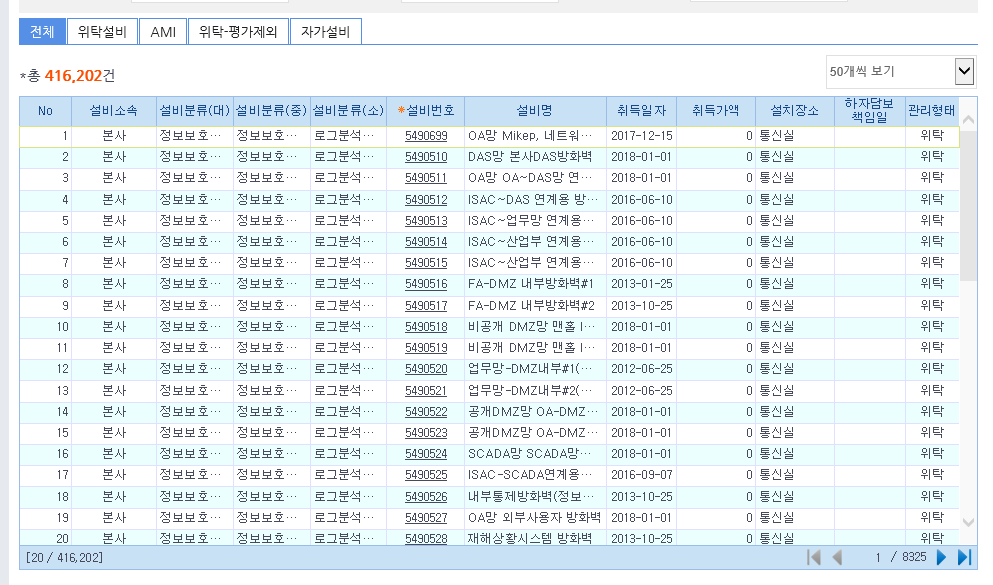

| 기능명 | 기능유형 |
| --- | --- |
| 전체설비조회 | EQ |
| 위탁설비조회 | EQ |
| AMI설비조회 | EQ |
| 위탁제외 설비조회 | EQ |
| 자가설비 조회 | EQ |

조회 대상 데이터는 동일
| 기능명 | 기능유형 |
| --- | --- |
| 설비조회 | EQ |
탭별로 SQL문이 동일할 경우 하나의 기능으로 산정  (모든 탭들의 결과를 기능(화면)이 최초  실행 시 한꺼번에 조회)

66

### Notes:
4. 주요 오산정 사례
 -검색조건에 따라 탭/시트/콤보박스  등으로 구분되어 있는 경우

<!-- Slide number: 67 -->
주요 오산정 사례

조회결과를 그대로 엑셀 등의 파일로 다운로드

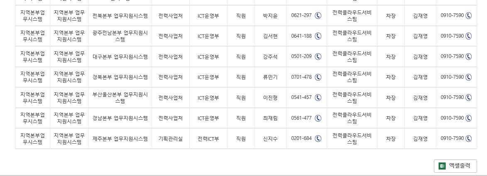
| 기능명 | 기능유형 |
| --- | --- |
| 담당자 조회 | EQ |
| 담당자 조회 엑셀출력 | EO/EQ |
| 기능명 | 기능유형 |
| --- | --- |
| 담당자 조회 | EQ |

출력매체만 상이한 동일기능으로 취급 → 화면상에 뿌려지는 조회기능 1개만 취급 (단, 다운로드 파일과 항목이 다를 경우는 다른기능)

67

### Notes:
4. 주요 오산정 사례
 - 조회결과를 그대로 엑셀 등의 파일로 다운로드

<!-- Slide number: 68 -->
주요 오산정 사례

논리적 데이터 단위가 아닌, 물리테이블 단위로 데이터기능 산정
| 기능명 | 기능유형 |
| --- | --- |
| PC설비 위치정보 내부논리파일 | ILF |
| 프린터 설비 위치정보 내부논리파일 | ILF |
| 서버 설비 위치 정보 내부논리파일 | ILF |
| 스토리지 설비 위치정보 내부논리파일 | ILF |
| 스위치 위치정보 내부논리파일 | ILF |
| 기능명 | 기능유형 |
| --- | --- |
| 설비 위치정보 내부논리파일 | ILF |
테이블 단위로 데이터 기능 산정 → 논리적 데이터셋 단위로 재산정

68

### Notes:
4. 주요 오산정 사례
 - 논리적 데이터 단위가 아닌, 물리테이블 단위로 데이터기능 산정

<!-- Slide number: 69 -->
주요 오산정 사례

정보 등록 후, 동시에 메일/문자 발송 (장애알림, 가입완료 안내 등)
| 기능명 | 기능유형 |
| --- | --- |
| 장애정보 내부논리파일 | ILF |
| 장애정보 등록 | EI |
| 장애정보 등록 후 문자발송 | EQ/EO |
| 장애정보 조회 | EI |
|  |  |
| 기능명 | 기능유형 |
| --- | --- |
| 설비 위치정보 내부논리파일 | ILF |
| 장애정보 등록(+문자발송 포함) | EI / EO |
| 장애정보 조회 | EQ |
EI와 동시에 발생하는 부가 기능은 별도로 산정하지 않으며, 하나의 트랜잭션으로 산정함.
(단, 상황에 따라 EI/EO와 같이 산정할 수 있음)

69

### Notes:
4. 주요 오산정 사례
 - 정보 등록 후, 동시에 메일/문자 발송 (장애알림, 가입완료 안내 등)

<!-- Slide number: 70 -->
주요 오산정 사례

패키지 SW에서 제공하는 기능을 산정 (연계, 보고서 등)

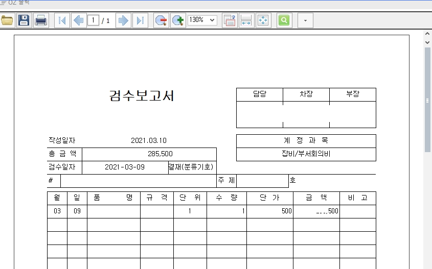
| 기능명 | 기능유형 |
| --- | --- |
| 검수보고서 조회 | EQ |
OZ뷰어 를 통한 보고서 출력
| 기능명 | 기능유형 |
| --- | --- |
| - | - |
연계솔루션(ESB 등)을 통한 연계처리
OZ리포트 등을 통한 보고서 출력
ARS솔루션 통한 전화걸기 기능 등
별도 상용SW로 구현되는 기능은 산정하지 않음.
(단, 결과를 별도로 기록하는 경우는 예외 / 직접 해당 기능을 구현한 경우 예외)

70

### Notes:
4. 주요 오산정 사례
 - 패키지 SW에서 제공하는 기능을 산정 (연계, 보고서 등)

<!-- Slide number: 71 -->
주요 오산정 사례

타 시스템에서 데이터를 그대로 복제 하는 경우
| 기능명 | 기능유형 |
| --- | --- |
| ERP인사정보 외부인터페이스파일 | EIF |
| 인사정보 복제 | EI |
| 인사정보 내부논리파일 | ILF |
| 인사정보 조회 | EQ |
|  |  |
| 기능명 | 기능유형 |
| --- | --- |
| ERP인사정보 외부인터페이스파일 | EIF |
| 인사정보조회 | EQ |
단순 복제의 경우, 해당 데이터를 옮겨오는 복제 부분을 산정하지 않음  → EIF를 조회하는 것과 동일하게 취급
(단, 별도 가공을 수행하면 산정함)

71

### Notes:
4. 주요 오산정 사례
 - 타 시스템에서 데이터를 그대로 복제 하는 경우

<!-- Slide number: 72 -->
주요 오산정 사례

타 시스템에서 데이터를 가공 후, 대상 시스템에 복제하는 경우
| 기능명 | 기능유형 |
| --- | --- |
| ##시스템 가입자 정보 외부인터페이스 | EIF |
| 가입자 실명 익명화 후 적재 | EI |
| ##시스템 가입자 정보 내부논리파일 | ILF |
| ## 가입자 정보 조회 | EQ |
|  |  |
| 기능명 | 기능유형 |
| --- | --- |
| ERP인사정보 외부인터페이스파일 | EIF |
| 가입자 실명 익명화 후 적재 | EI |
| ##시스템 가입자 정보 내부논리파일 | ILF |
| ## 가입자 정보 조회 | EQ |
외부데이터를 가져온 후, 내부 테이블에 별도 가공(암호화, 별도계산)을 하여 저장할 경우
복제된 결과는 내부논리파일로 산정함

72

### Notes:
4. 주요 오산정 사례
 - 타 시스템에서 데이터를 가공 후, 대상 시스템에 복제하는 경우

<!-- Slide number: 73 -->
주요 오산정 사례

조회 화면에서 바로 수정이 가능한 경우
| 기능명 | 기능유형 |
| --- | --- |
| 사용자 목록 조회 | EQ |
| 사용자 정보 수정 | EI |
| 사용자 정보 내부논리파일 | ILF |
|  |  |

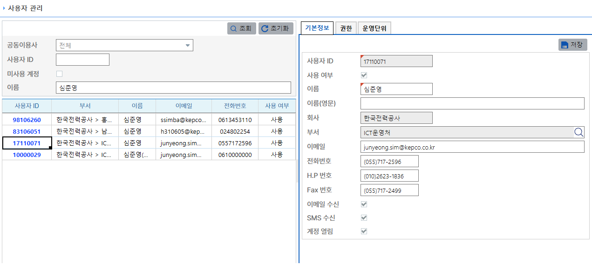

조회된 화면에서
수정사항 기재하여
[수정]  가능
사용자 검색 후, 정보 확인
| 기능명 | 기능유형 |
| --- | --- |
| 사용자 목록 조회 | EQ |
| 사용자 정보 상세보기 | EQ |
| 사용자 정보 수정 | EI |
| 사용자 정보 내부논리파일 | ILF |
상세보기와 수정은 같은 화면에서 이루어 지지만, [수정]이라는 버튼을 누르지 많으면 본래 기능인 정보 조회만 진행되는 것임.
요구사항 자체는 ‘사용자정보조회’, ‘정보수정’의 2개로 구성되어 별도 산정
(단, [수정]이라는 기능을 눌러 수정 전 내용을 불러오는 것은 조회로 보지 않음)

73

### Notes:
4. 주요 오산정 사례
 - 조회 기능인 화면에서 바로 수정이 가능한 경우.

<!-- Slide number: 74 -->
주요 오산정 사례

임시파일 생성 후, 이후 최종 저장
| 기능명 | 기능유형 |
| --- | --- |
|  |  |
| 고객상담내역 임시저장 | EI |
| 고객상담내역 내부논리파일 | ILF |
| 고객상담내역 최종저장 | EI |
|  |  |
| 기능명 | 기능유형 |
| --- | --- |
|  |  |
|  |  |
| 고객 상담내역 내부논리파일 | ILF |
| 고객 상담내역 저장 | EI |
| 기능명 | 기능유형 |
| --- | --- |
| 고객정보 외부인터페이스파일 | EIF |
| 고객정보+내역 임시저장 | EI |
| 고객상담내역 내부논리파일 | ILF |
| 고객상담내역 최종저장 | EI |
|  |  |
| 기능명 | 기능유형 |
| --- | --- |
| 고객정보 외부인터페이스파일 | EIF |
|  |  |
| 고객 상담내역 내부논리파일 | ILF |
| 고객 상담내역 저장 | EI |
임시저장 데이터는 산정하지 않음 / 외부 정보와 조합되어도 임시저장 데이터와 이를 생성하는 트랜잭션은은 기능으로 산정하지 않음
(임시정보 : 해당 Task 또는 Job 종료 후, 삭제되는 데이터)

74

### Notes:
4. 주요 오산정 사례
 - 임시파일 생성 후, 이후 최종 저장

<!-- Slide number: 75 -->
주요 오산정 사례

내용 등록간, 공통정보(자동문구, 자동첨부파일) 불러오기

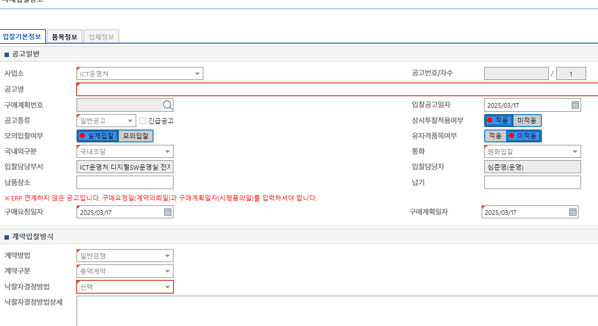
| 기능명 | 기능유형 |
| --- | --- |
| 공고 정보 등록 | EI |
| 공고 첨부파일 업로드 | EI |
| 공고 자동첨부파일 불러오기 | EQ |
| 공고정보 내부논리파일 | ILF |
|  |  |
공고등록
| 기능명 | 기능유형 |
| --- | --- |
| 공고정보 등록 | EI |
| 공고정보 내부논리파일 | ILF |

내용등록
자동첨부

첨부파일
공고첨부파일, 자동첨부파일목록 불러오기는 “공고등록”이라는 하나의 job을 위한 작업(task) 이므로 산정하지 않음
(단, 공고등록간 자동심사를 지역/면허/자격조회 등은 별도 창으로 이루어지는 Job으로 취급함)

75

### Notes:
4. 주요 오산정 사례
 - 내용 등록간, 공통정보(자동문구, 자동첨부파일) 불러오기

<!-- Slide number: 76 -->
주요 오산정 사례

단위프로세스 식별 권고사례 (SW사업대가산정가이드, 2024)

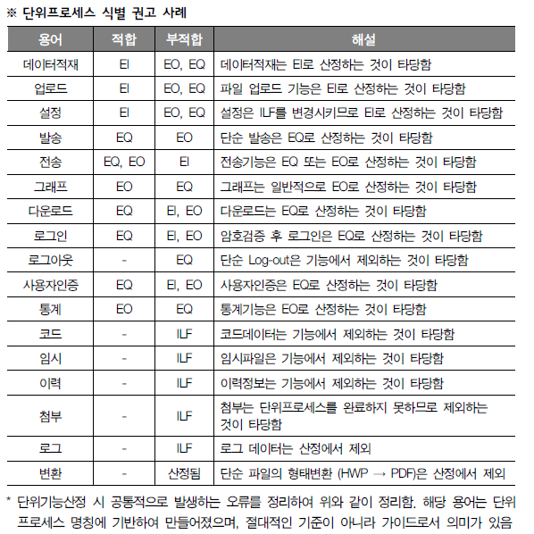
설정, 사용자 정보 변경 : EI
파일업로드 단일기능 : EI
게시글등록간 첨부파일 업로드 : X

발송/전송의 경우 : EQ  (조회 결과를 내보냄)
그래프/통계 등 : EO (조회결과를 가공함)
첨부파일 다운로드 : EQ (첨부파일 조회 후 내보냄)

로그인/사용자 인증 : EQ (인증정보를 조회)
로그아웃(단순) : 산정하지 않음
로그아웃(IP, 시간 등 기록) : EI (정보를 기록)

산정되지 않는 경우
 - 코드성데이터, 임시파일, 로그
 - 등록 중 첨부 가능(1JOB)
 - 단순 파일의 변환, 조회화면 출력 (출력매체만 다른 동일 기능)
 - 패키지sw 활용 기능

76

### Notes:
4. 주요 오산정 사례
 - 단위프로세스 식별 권고사례 (SW사업대가산정가이드, 2024)

<!-- Slide number: 77 -->
주요 오산정 사례

트랜잭션 기능 식별 사례 (SW사업대가산정가이드, 2024)

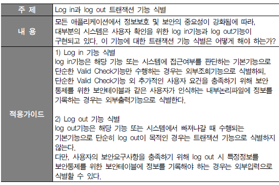

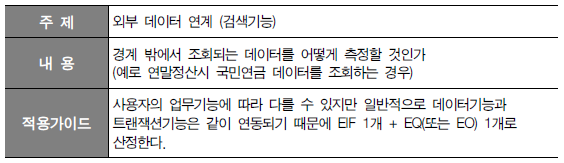

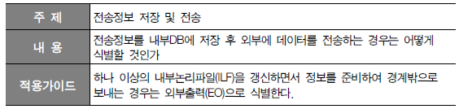

①

외부데이터의 조회 : EQ/EO

데이터갱신 후 외부로 보냄 : EO

②
로그인/사용자 인증 : EQ (인증정보를 조회)
로그아웃(단순) : 산정하지 않음
로그아웃(IP, 시간 등 기록) : EI (정보를 기록)

77

### Notes:
4. 주요 오산정 사례
 - 트랜잭션 기능 식별 사례 (SW사업대가산정가이드, 2024)

<!-- Slide number: 78 -->
주요 오산정 사례

기타
SAP ERP 스텐다드 테이블의 경우, SAP 기본 패키지 이므로
Add-On 프로그램(ABAP로 별도 개발) 기준으로는 EIF로 취급해야함
(단, ICT위탁의 경우, 참조하는 erp분야 응용SW가 많으므로 제외)
SAP ERP 스텐다드 테이블
(하드코딩 값을 출력하는 페이지) 표준대로면 산정하지 않음
→ 해당화면에 대한 작업 공수 발생하므로 최저인 EQ로 산정 권고
 / 또는 기능목록상으로만 관리
데이터기능이 없는 화면
(단순링크, 사장님말씀, 사이트맵)
트랜잭션이 일어나지 않는 데이터기능
존재할 수 없음.
또 어떤 사례가 있을지 생각

78

### Notes:
4. 주요 오산정 사례
 - 기타

<!-- Slide number: 79 -->

01 소프트웨어 대가산정

Contents
02 사용자 체감 기능 중심의 규모산정, 기능점수(Function Point)

03 기능점수 산정 절차 및 방법 (간이법)

04 주요 오산정 사례

05 실습

06 참고사항 (관련교육 등)

### Notes:

1
2
3
4
5

<!-- Slide number: 80 -->
실습

3. 트랜잭션 기능 식별 시 기능 중복 판단 기준은?
  ① 참조되거나 유지되는 ILF나 EIF가 같은 경우
  ② 경계를 넘나드는 데이터필드가 같은 경우
  ③ 처리 로직이 같은 경우
  ④ 위 모두
연습문제
1.기능점수(분석)의 특징은?
  ① 사용자가 요구하여 제공받는 기능들을 측정한다.
  ② 구현기술과는 무관하다.
  ③ 소프트웨어 개발 및 유지보수 규모를 측정한다.
  ④ 위의 세가지 모두 해당된다.
4. ILF나 EIF로 산정되는 것은 무엇인가?
  ① 임시파일
  ② 기술때문에 도입된 파일
  ③ 조회나 저장되지 않는 로그파일
  ④ 유지되는 판매실적 파일
2.사용자 관점 이란?
  ① 사용자의 업무적 요구를 사용자의 용어를 사용하여 공식적으로 기술
  ② 기술적 기능에 대한 기술
  ③ 개발자에 의해 승인
  ④ 기능점수산정에 사용될 수 없음
5. 다음 중 EI 기능이 아닌 것은?
  ① 자료조회를 위한 선택기준 입력기능
  ② ILF를 유지하는 위한 입력기능
  ③ ILF를 유지하지 않지만 시스템의 동작을 변경시키는 기능
  ④ 시간에 맞추어 자동으로 ILF를 유지하도록 동작하는 입력기능

80

### Notes:
연습문제 (객관식)
답 : 4 / 1 / 4 / 4 / 1
[1] 사용자 관점으로 측정, 구현기술에 무관한 측정, 개발 및 유지보수 규모 측정
[2] 기능점수는 개발자/기술적인 측면이 아닌 사용자 관점의 기능임 (사용자 업무 중심)
[3] 세가지 중, 하나라도 아니면 다른 기능으로 식별
[4] 임시테이블, 로그파일, 기술상 도입된 파일 등은 사용자 요구사항에 존재하지 않으므로 식별되지 않음 (단, 적재된 로그를 조회/분석하는 시스템의 경우는 예외.. 의미있는 사용자 데이터가 됨)
[5] 자료조회를 위한 선택기준(조회조건)을 입력하는 것만으로는 아무런 트랜잭션이 일어나지 않는다.
   [5-3 관련] 애플리케이션 경계를 통해 들어온 데이터가 시스템의 동작을 바꾸는 제어 정보가 아니라면, 적어도 하나의 ILF 를 유지해야 함

<!-- Slide number: 81 -->
실습

8.다음 중 어떤 것이 EQ가 되는가?
  ① Navigation(HTML웹페이지 형태) 기능의 메뉴
  ② 파생데이터를 생성하여 보여주는 기능
  ③ 게시판 목록을 보여주는 기능
  ④ 하드코딩 된 자료를 보여주는 기능
연습문제
6. EI의 주요 의도는?
  ① 하나 이상의 ILF를 변경시키거나 시스템의 동작을 변경시킨다.
  ② 하나 이상의 EIF를 변경시키거나 시스템의 동작을 변경시킨다.
  ③ 사용자에게 정보를 보여준다.
  ④ 위 모두
9. EQ와 EO에서 모두 반드시 수행되어야 하는 처리 로직은?
  ① 시스템의 동작 변경
  ② 파생데이터생성
  ③ 하나이상의 ILF나 EIF참조
  ④ 정보를 준비하여 경계밖으로 보냄
7. EO에 해당되지 않는 것은?
  ① 고유한 처리로직과 고유한 계산식이 요구되는 각각의 보고서
  ② 파이차트로 보여지는 통계적데이터
  ③ EQ와 연관된 에러/확인메시지
  ④ 파일을 수정하지 않으면서 파생데이터를 만드는 보고서
10. 다음 중 옳은 것은?
  ① 타 시스템의 기능을 단순 Link로 연결하여 동일한 기능명세서 작성
  ② HTML로 작성된 회사 소개는 EQ로 산정함
  ③ 조회결과 화면을 엑셀로 다운받는 것을 각각의 EQ로 산정함
  ④ 메뉴가 DB조회로 보이는 경우, 하드코딩과 동일하게 식별하지 않음

81

### Notes:
연습문제 (객관식)
답 : 1 / 3 / 3 / 3 / 답 없음(함정)
[6] EIF는 EI될 수 없다 → 이럴 경우는 ILF로 인정함. / 사용자에게 정보를 보여준다.. EQ/EO
[7] EQ된 결과에 추가적인 로직으로 파생데이터를 만드는 경우.. (차트, 통계, 금액계산 등)
[8] ①④ 산정대상 아님 / ② EO
[9] ①EI ②EO ③EQ/EO ④EI/EO/EQ
[10] 전부 산정대상이 아님

<!-- Slide number: 82 -->
실습

실습 (문제)
계좌이체 약정서를 만들어야 함 (개인)
 - [동의]개인정보수집 동의, 개인정보 3자 제공 동의(국세청), 고유식별정보 동의 를 받은 후,
 - [개인정보입력] 개인정보를 입력..( 성명, 주민번호, 휴대전화번호, 주소 )
 - [휴대전화인증]입력한 성명, 주민번호, 휴대전화번호를 넘겨서 휴대전화 본인인증을 수행
- [계좌정보 및 한전 담당자 입력] 은행명, 계좌번호, 한전 담당자 사번(이름으로 검색 가능)
     (→성명, 휴대전화번호 등은 이전에 입력한 데이터가 그대로 따라옴)
 - [신청완료] “신청＂버튼 클릭

※ 각 항목에 대한 검증..(성명을 입력해주세요 등)은 신경쓰지 않음.
※ 한전 담당자 정보는  ERP인사시스템과 연계함
※ 국세청에 전송되는 정보는 계좌거래 내역이므로, 신청단계에서는 정보가 넘어가지 않음. (고려할 필요 없음)
※ 휴대전화 본인인증은 타 기관(통신사)의 인증을 사용함

82

### Notes:
실습

<!-- Slide number: 83 -->
실습

실습 (답)
| 대분류 | 중분류 | 소분류 | 단위기능명 | CRUD | 기능유형 | 참고 데이터파일 |
| --- | --- | --- | --- | --- | --- | --- |
| 계좌이체약정서 | 개인 | 수집동의 | 개인정보 수집 동의 | C | EI | 계좌이체 약정정보 내부논리파일 |
|  |  | 정보등록 | 계좌이체 약정서 작성 -개인정보 등록 | C | EI | 계좌이체 약정정보 내부논리파일 |
|  |  |  | 계좌이체 약정서 작성 -계좌정보 등록 | C | EI | 계좌이체 약정정보 내부논리파일 |
|  |  |  | 계좌이체 약정정보 내부논리파일 | 데이터 | ILF |  |
|  | 본인인증 | 휴대전화 인증 | 휴대전화 본인인증 | R | EQ | 휴대전화 인증 외부인터페이스 |
|  |  |  | 휴대전화 인증정보 외부인터페이스 파일 | 데이터 | EIF |  |
|  | 공통 | 담당자 조회 | 한전 담당자 정보 조회 | R | EQ | 한전 인사정보 외부인터페이스 |
|  |  |  | 한전 인사정보 외부인터페이스 파일 | 데이터 | EIF |  |

38.1
| 대분류 | 중분류 | 소분류 | 단위기능명 | CRUD | 기능유형 | 참고 데이터파일 |
| --- | --- | --- | --- | --- | --- | --- |
| 계좌이체약정서 | 개인 | 정보등록 | 계좌이체 약정서 등록 | C | EI | 계좌이체 약정정보 내부논리파일 |
|  |  |  | 계좌이체 약정정보 내부논리파일 | 데이터 | ILF |  |
|  | 본인인증 | 휴대전화 인증 | 휴대전화 본인인증 | R | EQ |  |
|  |  |  | 휴대전화 인증정보 외부인터페이스 파일 | 데이터 | EIF | 휴대전화 인증 외부인터페이스 |
|  | 공통 | 담당자 조회 | 한전 담당자 정보 조회 | R | EQ |  |
|  |  |  | 한전 인사정보 외부인터페이스 파일 | 데이터 | EIF | 한전 인사정보 외부인터페이스 |
30.1

83

### Notes:
실습

<!-- Slide number: 84 -->

01 소프트웨어 대가산정

Contents
02 사용자 체감 기능 중심의 규모산정, 기능점수(Function Point)

03 기능점수 산정 절차 및 방법 (간이법)

04 주요 오산정 사례

05 실습

06 참고사항 (관련교육 등)

### Notes:

1
2
3
4
5

<!-- Slide number: 85 -->
참고사항

★
관련교육
[기능점수 전문인력 양성 기본/심화 교육] 한국소프트웨어 측정원/KOSMA
[SW사업 대가산정 교육(집합)] 한국소프트웨어 산업 협회/KOSA
[SW사업 대가산정 교육(온라인)] 한국소프트웨어 산업 협회/KOSA
관련 가이드

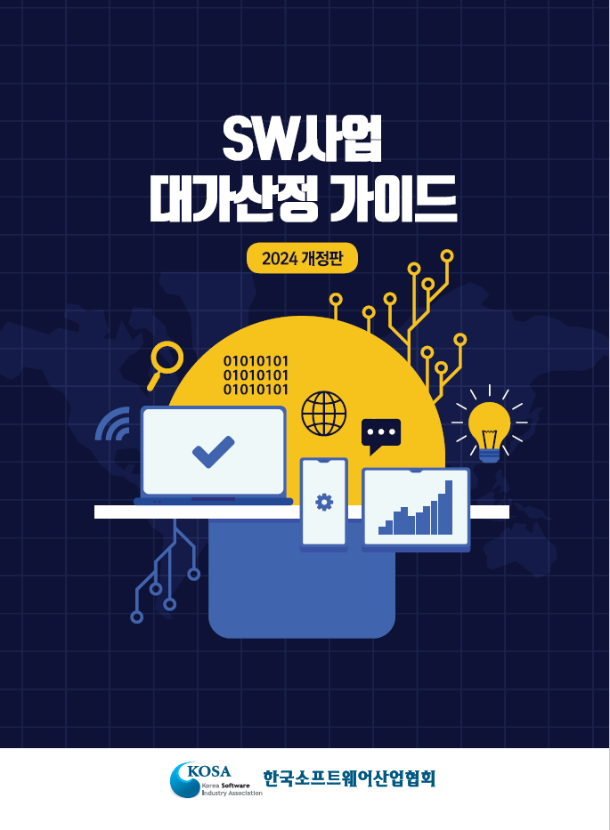

관련 자격
[CFPS(Certified FP Specialist)/CFPP] ITFUG

85

### Notes:
관련교육, 관련자격

<!-- Slide number: 86 -->
참고사항

향후과제 (필요사항/애로사항)
현황
문제점
기능점수 관련 전문교육 부재
규모산정 기준 모호
   - SW사업대가산정가이드로는 현업 적용 사례 등 부족
3. 표준을 벗어난 일부 지침 (수정 삭제 1개 세트 취급)
4. 관련 전문인력 부재 / 품질관리 조직 부재
5. 잦은 담당자 변경
산정기능의 판정 어려움
[한전-KDN] 간 기준 부재 (시스템별 작성 상이)
[한전-개발업체] 간 기준 없음 (비용산정 신뢰도 저하)
단위시스템별 기능목록 현행화 체계 부재
기능점수 산출물의 적정성 판단능력 미달
개 선 방 향
기능산정 기준 및 작성용어의 표준화로 산출물간 일치성 확보
표준에 정의되지 않은 한전 시스템만의 일부 특성을 적용 → 내부 표준 정립
사례기준의 산정/판정 방법을 제시하여 기능점수(FP)에 대한 빠른 내재화 유도

86

### Notes:
다들 알고 있지만 현실적으로 많은 공수가 필요하여 어려운…

<!-- Slide number: 87 -->

감사합니다

ICT운영처 디지털SW운영실

### Notes:
ㄳㄳㄳㄳㄱㄱㄱㅂㄱㅂㄱㅂㅈㄱㅂㅈㄱㅂㅈㄱㄼ

<!-- Slide number: 88 -->
빈페이지

### Notes:
다들 알고 있지만 현실적으로 많은 공수가 필요하여 어려운…

<!-- Slide number: 89 -->

ICT운영처
SW개발방법론 교육

2025. 3. 20(목)

Global Energy & Solution Leader

### Notes:

<!-- Slide number: 90 -->

Ⅰ
사내 SW사업 추진절차
Ⅱ
SW개발방법론 및 프로젝트관리
Ⅲ
인수인계 및 운영 방법
Ⅳ
질의 & 응답

Global Energy & Solution Leader

### Notes:

<!-- Slide number: 91 -->

Ⅰ
사내 SW사업 추진절차

<!-- Slide number: 92 -->
PART Ⅰ
사내 SW 추진 절차

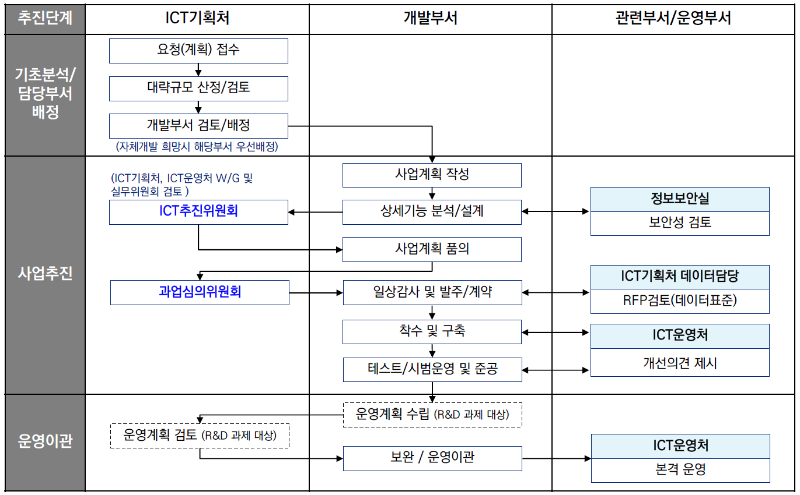

<!-- Slide number: 93 -->
PART Ⅰ
과업심의위원회 대상

모든 소프트웨어사업(상용SW 포함)에 대하여 적용한다.
단, 단순 H/W(Appliance 포함) 도입·설치, 단순 동영상 제작, 네트워크 등 인프라 수수료와 같이 소프트웨어사업으로 볼 수 없는 경우는 적용대상에서 제외
ICT추진위원회 대상

가. SW 개발용역(신규·재개발·보완개발)
나. 3억원 이상 HW 도입사업(일상감사 대상)
다. 커스터마이징이 포함된 패키지SW 구매 사업

<!-- Slide number: 94 -->
PART Ⅰ

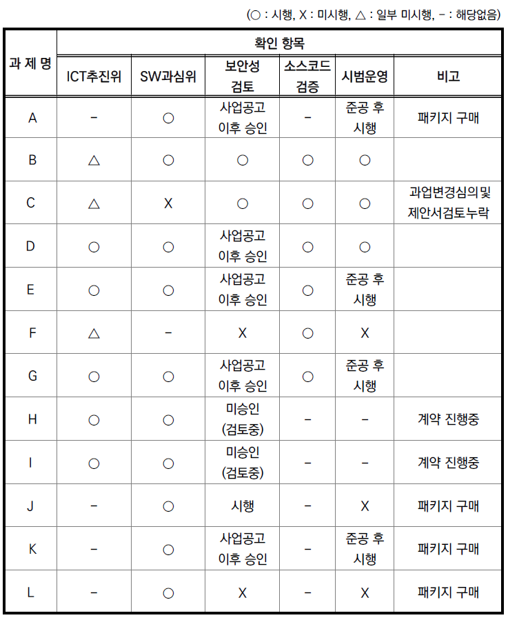
성과감사 지적사항

<!-- Slide number: 95 -->

Ⅱ
개발방법론/프로젝트관리

<!-- Slide number: 96 -->
PART Ⅱ
SW 개발방법론이란

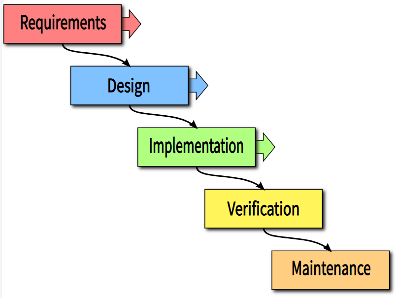
소프트웨어를 생산하는 데에 필요한 프로그래밍 개발 과정들을 정리하고 표준화하여
각 개인이 개발과정에서의 일관성을 유지하고
프로그래머들간의 효과적인 협업이 이루어 질 수 있도록 돕기 위한 방법론이다.

1970년대 1969년까지 구조적 프로그래밍이 주로 쓰였다.

<!-- Slide number: 97 -->
PART Ⅱ
KEP-Waterfall 개요

• 순차적인 소프트웨어 개발프로세스로, 개발의 흐름이 마치 폭포수처럼 지속적으로
  아래로 향하는 것처럼 보이는 데서 이름이 붙여졌다.
• 폭포수모델의 흐름은 소프트웨어 요구사항분석 단계에서 시작하여, 설계, 구현,
  시험, 이행단계 등을 거쳐, 유지보수 단계에까지 이른다.
적용대상 및 범위

• 중장기 정보화 전략을 반영하기 위한 신시스템 구축 프로젝트
• 개발범위가 명확히 과제수행사에게 전달된 프로젝트
• 중규모 이상의 프로젝트

<!-- Slide number: 98 -->
PART Ⅱ
 PP. 착수
AN. 분석
DE. 설계
 CO. 구현
TE. 시험
IM. 이행
 PP 개발준비

 PP 개발준비
방법론 전체 프로세스

AN10.현황 분석
DE10.SW 논리설계
P10. 사업수행계획 수립
TE10.통합시험
IM10.매뉴얼개발
CO10.SW 코딩
AN11.현행업무 및 시스템
분석
DE11.유스케이스 분석
TE11.통합시험 계획 수립
PP11.사업수행계획 수립
CO11.단위 SW 코딩
IM11.사용자안내서 작성
TE12.통합시험 설계
DE12.데이터 설계
CO12.데이터베이스개발
PP12.착수계 제출
IM12.시스템운영서 작성
AN20.시스템요구사항분석
TE13. 통합시험 수행
DE13.코드 식별 및 정의
PP13.착수 보고
AN21.요구사항 수집
CO20.단위 시험
IM20.시스템사용교육
TE20.시스템시험
AN22.요구사항 정의
CO21.단위시험 설계
DE20.SW 상세설계
IM21.교육계획 수립
TE21.시스템시험 계획 수립
IM22.교육수행
CO22.단위시험 수행
DE21.사용자 인터페이스
설계
AN30.시스템 구조설계
TE22.시스템시험 설계
CO23.코드 점검 수행
DE22.데이터베이스 상세
설계
IM30.이행 준비
AN31.시스템 구조 설계
TE23. 시스템시험 수행
DE23.인터페이스/데이터
베이스 연관분석
CO30.구현단계 검토
IM31.이행계획 수립
AN40.TO BE 프로세스 개발
DE24.모듈 설계
CO31.산출물 품질 검토
IM40.인수시험
AN41.TO BE 업무 분석
DE25.보안 설계
CO32.산출물 사용자 검증
IM41.인수시험 계획 수립
AN50.개발표준 정의
DE26. 시스템인터페이스
설계
IM42.인수시험 설계
AN51.UI 표준 정의
DE27.용어정의
IM43.인수시험 수행
AN52.개발 표준 정의
DE30.데이터전환
IM50.설치 및 인도
AN60.시험계획 수립
DE31. 데이터전환 계획 수립
IM51.SW 설치 수행
AN61.총괄시험계획 수립
DE32.데이터전환 프로그램
설계
IM52.SW 인도
AN70.분석단계  검토
DE40.시험계획 수립
AN71.산출물 품질 검토
DE41.단위 시험계획 수립
AN72.산출물 사용자 검증
DE50.설계단계 검토
DE51.산출물 품질 검토
DE52.산출물 사용자 검증

### Notes:

<!-- Slide number: 99 -->
PART Ⅱ
KEP-Package 개요

• 패키지 솔루션을 요구사항에 맞게 커스터마이징 개발하는 방법론을 의미한다.
적용대상 및 범위
• 중장기 정보화전략을 반영하기 위한 신시스템 구축 프로젝트
• 개발범위가 명확히 과제수행사에게 전달된 프로젝트
• 중규모 이상의 프로젝트

<!-- Slide number: 100 -->
PART Ⅱ
 PP. 착수
AN. 분석
DE. 설계
 CO. 구현
TE. 시험
IM. 이행
 PP 개발준비

 PP 개발준비

AN10.솔루션 분석
DE10.상세설계
P10. 사업수행계획 수립
TE10.통합시험
IM10.매뉴얼개발
CO10.SW 코딩
방법론 전체 프로세스
AN11. 솔루션 기능분석
DE11.데이터베이스 설계
PP11.사업수행계획 수립
CO11.단위 SW 코딩 및 데이터베이스 개발
TE11.통합시험 계획 수립
IM11.사용자안내서 작성
AN12.솔루션 교육수행
DE12.프로그램 설계
PP12.착수계 제출
TE12.통합시험 설계
IM12.시스템운영서 작성
CO20.단위 시험
AN20.요구사항분석
DE13.화면 설계
PP13.착수 보고
TE13. 통합시험 수행
CO21.단위시험 설계
IM20.시스템사용교육
AN21.현행 업무 및 시스템
분석
DE14.모듈 설계
CO22.단위시험 수행
TE20.시스템시험
IM21.교육계획 수립
AN22.요구사항 수집(인터뷰)
DE15.시스템인터페이스
설계
TE21.시스템시험 계획 수립
CO23.코드 점검 수행
IM22.교육수행
AN23.GAP 분석
DE16.보안 설계
AN24.요구사항 정의
TE22.시스템시험 설계
CO30.구현단계 검토
IM30.이행 준비
DE20.데이터전환
AN25.용어정의
TE23. 시스템시험 수행
CO31.산출물 품질 검토
IM31.이행계획 수립
DE21.데이터전환 계획 수립
AN30.모델링
CO32.산출물 사용자 검증
IM40.인수시험
DE22.데이터전환 프로그램
설계
AN31.프로세스 모델링
IM41.인수시험 계획 수립
AN32.데이터 모델링
DE30.시험계획 수립
IM42.인수시험 설계
AN33.프로세스/엔티티 연관분석
DE31. 단위시험계획 수립
AN40.시스템 구조 설계
IM43.인수시험 수행
DE40.설계단계 검토
AN41.시스템 구조 설계
IM50.설치 및 인도
DE41.산출물 품질 검토
AN50.개발표준 정의
IM51.SW 설치 수행
DE42.산출물 사용자 검증
AN51.UI표준 정의
IM52.SW 인도
AN52.개발표준 정의
AN60.프로토타이핑
AN61.프로토타이핑 구축
AN62.프로토타이핑 실시
AN70.시험계획 수립
AN71.총괄시험계획 수립
AN80.분석단계 검토
AN81.산출물 품질 검토
AN82.산출물 사용자 검증

<!-- Slide number: 101 -->
PART Ⅱ
KEP-Agile 개요

• 소프트웨어개발보다는 팀의 개선과 프로젝트 관리를 위한 방법론으로 경험적 관리기법 중 하나,
  다른 방법론들과 달리 구체적인 프로세스를 명확하게 제시하지 않으며, 개발조직을 운영하는
  효율적인 운영방식(지침) 정도로 생각할 수 있다.
적용대상 및 범위
• 신규 구축SI 보다는 솔루션 개발 및 기존 시스템 유지보수
• 중/소 규모 및 팀 단위 연구과제 프로젝트
• 개선 및 고도화 프로젝트

<!-- Slide number: 102 -->
PART Ⅱ
방법론 전체 프로세스
 PP. 착수
CO. 반복구축
IM. 이행
 PP 개발준비

CO10.릴리즈 계획 수립
P10. 사업수행계획 수립
IM10.매뉴얼 개발
PP11.사업수행계획 수립
IM11.사용자 안내서 작성
CO11.릴리즈 목표 확인
PP12.착수계 제출
IM12.시스템 운영서 작성
CO12.릴리즈 대상 제품
백로그 선정 및 구체화
PP13.착수 보고
IM20.최종릴리즈 수행
CO13.릴리즈 대상 제품
백로그 추정
IM21.제품 릴리즈
CO20.스프린트 계획 수립
CO21.스프린트 백로그 정의
 AN. 분석
 PP 개발준비

CO22.스프린트 백로그 추정
AN10. 제품백로그정의
CO30.스프린트 수행
AN11.제품백로그 항목식별
CO31.일일스크럼 회의 수행
AN12.제품백로그 구체화
CO32.일일 스프린트 수행
CO40.스프린트 검토
CO41.스프린트 검토(제품)
CO42.스프린트 회고(프로세스)
CO50.릴리즈  검토
CO51.릴리즈 검토
CO52.릴리즈 보완

<!-- Slide number: 103 -->
PART Ⅱ
일반적인 SW개발 절차

Ⅲ. 요구사항 분석
Ⅳ. 사업계획
Ⅴ. 발주 및 계약
 Ⅱ. IT기획
 PP 개발준비
Ⅵ. 착수 및 사업통제
Ⅶ. 준공 및 이관

P201. IT기획
P301. 개발 요청
P401. 사업계획 수립
P701. SW개발 준공
P601. 착수
P501. 제안요청서 작성
사업범위 산정
시스템 개발 요청
시험
착수 준비
IT수요조사
제안요청서 작성
예산 및 일정 계획
P302. 요구사항 정의/분석
최종보고회
사업 착수
ICT중장기전략계획(ISP) 수립
제안요청서 검토
사업관리 계획
시범운영
요구사항 정의
연간ICT계획 수립
용역수행환경 구성
입찰 공고
P402. 사업품의
요구사항 분석
준공검사
사업별 마스터플랜(ISMP) 수립
P602. 모니터링 및 통제
P502. 공급자선정/계약
사업예산 산출
사업계획 검토/조정
대금지급 및 자산취득
공정관리
P202. 정보화실적 및
효과 분석
요구사항 확정
사업계획 승인
제안서 평가
P702. 정보시스템 이관
품질관리
정보화 실적 및 효과 분석
P303. 요구사항 관리
사업계획 변경
낙찰자 선정
인수인계
변경관리
요구사항변경 요청
계약 체결
이슈관리
부록

변경요청 검토/평가
감리
투입인력 변경관리
사업관리 관련 서식
변경요청 반영
SW사업 법제도 준수 가이드
KEP-Waterfall 방법론
KEP-Package 방법론
KEP-Agile 방법론
모바일 APP 개발 표준가이드라인
데이터 요구사항 적용 가이드

<!-- Slide number: 104 -->
PART Ⅱ
사업 비용과 기간에 따라 대, 중, 소의 구분은 다음의 테일러링 기준을 따른다.
| 구분 | 6개월 미만 | 6~12개월 미만 | 12~24개월 미만 | 24개월 이상 |
| --- | --- | --- | --- | --- |
| 2억 미만 | 소 | 소 | 소 | 소 |
| 2억~ 5억 미만 | 소 | 소 | 중 | 중 |
| 5억~10억 미만 | 소 | 중 | 중 | 중 |
| 10억~20억 미만 | 중 | 중 | 대 | 대 |
| 20억~40억 미만 | 중 | 중 | 대 | 대 |
| 40억 이상 | 대 | 대 | 대 | 대 |

<!-- Slide number: 105 -->
PART Ⅱ
| 공정/ 주기 | 산출물 | 비고 | 대 | 중 | 소 |
| --- | --- | --- | --- | --- | --- |
| 설계 | 전환계획서 |  | ○ | - | - |
|  | 매핑정의서 |  | ○ | ○ | ○ |
|  | 전환프로그램목록 |  | ○ | ○ | ○ |
|  | 단위시험계획서 |  | ○ | - | - |
|  | 산출물검토결과서 |  | ○ | ○ | - |
|  | 품질점검보고서 | 필수 | ○ | ○ | - |
| 구현 | 소스코드 | 필수 | ○ | ○ | ○ |
|  | 실행프로그램코드 | 필수 | ○ | ○ | ○ |
|  | 단위시험케이스 |  | ○ | ○ | - |
|  | 단위시험결과서 | 필수 | ○ | ○ | ○ |
|  | SW테스팅결과서(코딩/메모리/보안규칙/DB검증) | 필수 | ○ | ○ | ○ |
|  | SW테스팅결과서(산출물현행화) |  | ○ | ○ | ○ |
|  | 품질점검보고서 | 필수 | ○ | ○ | - |
| 시험 | 통합시험계획서/시나리오 |  | ○ | ○ | - |
|  | 통합시험결과서 | 필수 | ○ | ○ | ○ |
|  | 시스템시험계획서/시나리오 |  | ○ | ○ | - |
|  | 시스템시험결과서 | 필수 | ○ | ○ | ○ |
|  | 웹호환성점검보고서 |  | ○ | ○ | ○ |
|  | 보안취약점진단결과서 | 필수 | ○ | ○ | ○ |
| 이행 | 사용자안내서 | 필수 | ○ | ○ | ○ |
|  | 시스템운영서 | 필수 | ○ | ○ | ○ |
|  | 교육계획서 |  | ○ | - | - |
|  | 교육결과서 |  | ○ | ○ | - |
|  | 이행계획서 |  | ○ | ○ | - |
|  | 인수시험계획서/시나리오 |  | ○ | ○ | - |
|  | 인수시험결과서 | 필수 | ○ | ○ | ○ |
|  | 인도확인서 | 필수 | ○ | ○ | ○ |
| 공정/ 주기 | 산출물 | 비고 | 대 | 중 | 소 |
| --- | --- | --- | --- | --- | --- |
| 착수 | 테일러링결과서 | 필수 | ○ | ○ | ○ |
|  | 사업수행계획서 | 필수 | ○ | ○ | ○ |
|  | 품질보증계획서 | 필수 | ○ | ○ | ○ |
|  | 착수계 | 필수 | ○ | ○ | ○ |
| 분석 | 현행시스템분석서 |  | ○ | - | - |
|  | 인터뷰결과서 |  | ○ | ○ | - |
|  | 요구사항정의서 | 필수 | ○ | ○ | ○ |
|  | 시스템아키텍처정의서 | 필수 | ○ | ○ | - |
|  | 업무흐름도 |  | ○ | ○ | - |
|  | UI표준정의서 |  | ○ | ○ | - |
|  | 개발표준정의서 |  | ○ | ○ | - |
|  | 총괄시험계획서 | 필수 | ○ | ○ | ○ |
|  | 산출물검토결과서 |  | ○ | ○ | - |
|  | 품질점검보고서 | 필수 | ○ | ○ | - |
| 설계 | 유스케이스설계서 | 필수 | ○ | ○ | - |
|  | 데이터베이스설계서(개념데이터모델) |  | ○ | - | - |
|  | 데이터베이스설계서(논리/물리데이터모델) | 필수 | ○ | ○ | ○ |
|  | 코드정의서 |  | ○ | - | - |
|  | 메뉴구조도 |  | ○ | ○ | ○ |
|  | UI설계서 | 필수 | ○ | ○ | ○ |
|  | CRUD매트릭스 |  | ○ | - | - |
|  | 프로그램목록 | 필수 | ○ | ○ | ○ |
|  | 프로그램설계서 | 필수 | ○ | ○ | ○ |
|  | 보안설계서 | 필수 | ○ | ○ | - |
|  | 시스템인터페이스설계서 | 필수 | ○ | ○ | - |
|  | 용어사전 |  | ○ | - | - |

<!-- Slide number: 106 -->

Ⅲ
인수인계 및 운영 방법

<!-- Slide number: 107 -->
PART Ⅲ
인수인계

운영부서와 SW운영환경을 확인하고 공급자로부터 SW 및 산출물을 인수하여 인수한 SW 및 산출물의 관리책임을 운영부서로 인계한다.
| 사업책임자, 운영수행자 |  |
| --- | --- |
| 사업관리자 |  |
| 인계자, 사용자, EA담당자 |  |
시작
인수인계 준비
T1
종료
인수인계 보고
T3
인수인계 수행
T2
T1. 인수인계서(P702-F01)를 작성한다.
T2. 사업관리자는 SW개발용역의 경우 인수인계서(P702-F01)에 인계자, 사용자 및 EA담당자의 서명
     또는 날인을 받는다.  IT설비도입부서담당자는 HW 및 상용SW의 경우 운영수행자에게
     IT설비내역을 공문으로 인계한다.
T3. 인수인계서(P702-F01)를 사업책임자에게 보고하고 준공 후 즉시 운영수행자에게 공문으로 전달한다

<!-- Slide number: 108 -->
PART Ⅲ
SW개발용역인 경우 운영수행 부서로 인계할 산출물
| 구분 | 산출물 |
| --- | --- |
| 계약 | ○ 계약서 (계약일반조건, 계약특수조건 포함) 사본 |
| 분석 | ○ 요구사항 정의서 (공급자가 분석 수행 시) ○ 요구사항 분석서 (P301-F02) (발주자가 분석 수행 시) 중 계약서 및 착수계 (P601-F01)\_(공급자)사업수행계획서에 명시된 산출물 |
| 설계 | ○ 유스케이스 설계서 ○ 프로그램 목록 ○ UI설계서 ○ 시스템인터페이스 설계서 ○ 데이터베이스논리/물리 설계서 중 계약서 및 착수계 (P601-F01)\_(공급자)사업수행계획서에 명시된 산출물 |
| 구현 | ○ 소스코드 및 실행 프로그램 코드 ○ SW테스팅 결과서 |
| 시험 | ○ 통합시험 결과서 ○ 시스템시험 결과서 ○ 인수시험 결과서 ○ 시스템 취약점 결과보고서(정보보안실) ○ 웹취약점 점검보고서(정보보안실) ○ 보안취약점 진단결과서(정보보안실) 중 계약서 및 착수계 (P601-F01)\_(공급자)사업수행계획서에 명시된 산출물 |
| 이행 | ○ 사용자 안내서 ○ 시스템 운영서 ○ 시범운영 보고서 (P701-F01) ○ 준공검사 보고서 (P701-F03) ○ 계약서 및 착수계 (P601-F01)\_(공급자)사업수행계획서에 명시된 모든 산출물 파일 수록 DVD (소스코드 및 실행 프로그램 코드 포함) |

<!-- Slide number: 109 -->
PART Ⅲ
자체개발인 경우 운영수행 부서로 인계할 산출물
| 구 분 | 산출물 |
| --- | --- |
| 설 계 | ○ 프로그램 목록 |
|  | ○ 시스템 인터페이스 설계서 |
|  | ○ 데이터베이스 논리/물리 설계서 |
| 구 현 | ○ 소스코드 및 실행 프로그램 코드 |
| 시 험 | ○ 인수시험 결과서 |
|  | ○ 웹취약점 점검보고서 (정보보안실) |
|  | ○ 보안취약점 진단결과서 (정보보안실) |
| 이 행 | ○ 사용자 안내서 |
|  | ○ 시스템 운영서 |

<!-- Slide number: 110 -->
PART Ⅲ
모니터링

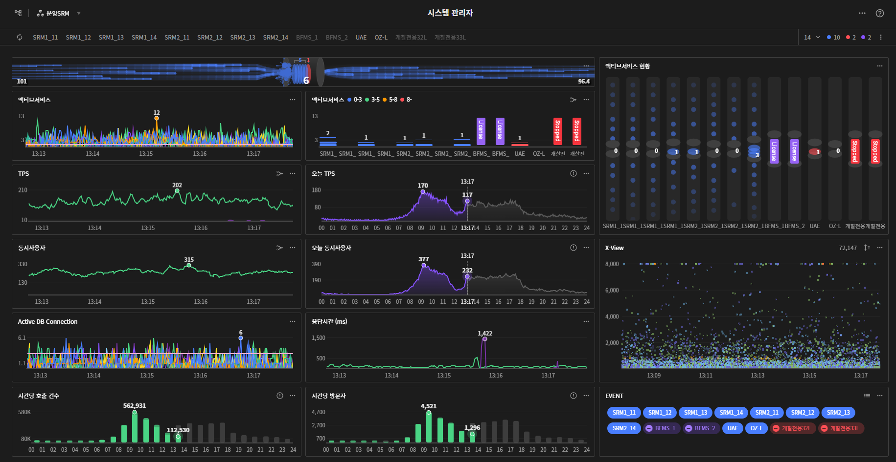

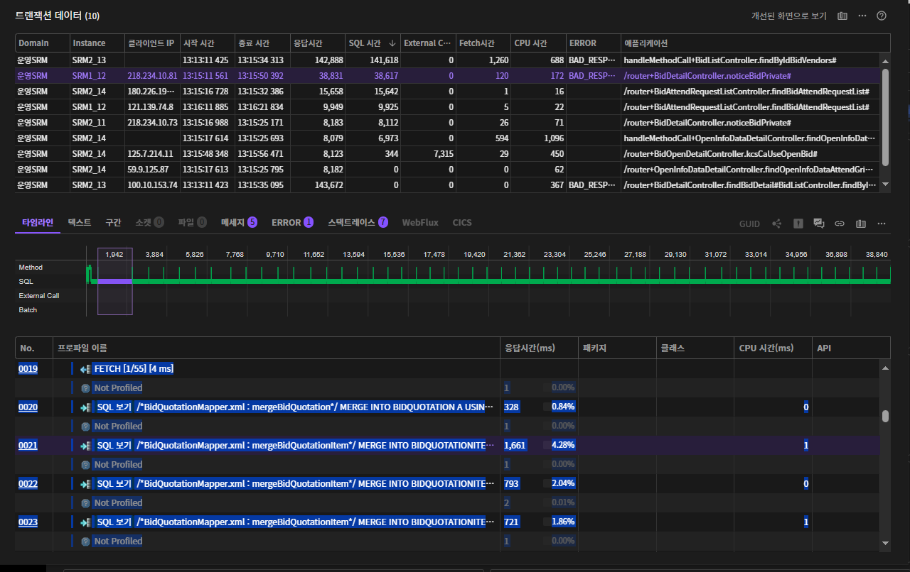

<!-- Slide number: 111 -->

Ⅳ
질의 & 응답

<!-- Slide number: 112 -->
감사합니다

Global Energy & Solution Leader
