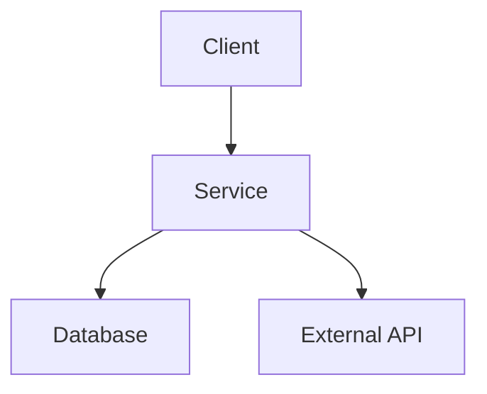

# 시스템 아키텍처 문서

**시스템명:** 　|　**버전:** 　|　**작성일:** YYYY-MM-DD　|　**작성자:**

---

## 1. 개요

> (예: 트래픽 급증에 대응하는 확장 가능한 3계층 구조)

---

---pb---

## 2. 시스템 구성도

```
[Client Layer]
      |
[API Gateway]
      |
[Service Layer]
      |
[Data Layer]
```

---

---pb---

## 3. 기술 스택

| 계층 | 기술 | 버전 | 비고 |
|------|------|------|------|
| Frontend | (예: React) | (예: 19.x) | (예: App Router) |
| Backend | (예: Node.js) | (예: 22.x) | (예: NestJS) |
| Database | (예: PostgreSQL) | (예: 16.x) | (예: 복제 구성) |
| Infrastructure | (예: Kubernetes) | (예: 1.30) | (예: EKS) |

---

---pb---

## 4. 주요 컴포넌트

### 4.1 컴포넌트 A

- **역할:** (예: 인증/인가 처리)
- **의존성:** (예: User Store)
- **주요 기능:**
  1. (예: 토큰 발급)
  2. (예: 권한 검증)

### 4.2 컴포넌트 B

- **역할:** (예: 비즈니스 오케스트레이션)
- **의존성:** (예: 컴포넌트 A)
- **주요 기능:**
  1. (예: 요청 라우팅)
  2. (예: 트랜잭션 관리)

---

---pb---

## 5. 데이터 흐름

> (예: 클라이언트 요청이 게이트웨이를 거쳐 서비스→DB로 전달)



---

---pb---

## 6. 보안

- 인증 방식: (예: OAuth2 + JWT)
- 권한 체계: (예: RBAC)
- 데이터 암호화: (예: TLS 1.3, 컬럼 암호화)

---

---pb---

## 7. 성능

| 지표 | 목표 | 측정 방법 |
|------|------|----------|
| 응답 시간 | < 200ms | (예: APM 샘플링) |
| 처리량 | 1000 RPS | (예: 부하 테스트) |
| 가용성 | 99.9% | (예: 모니터링 지표) |

---

## 8. 참고 자료

- (예: 설계 결정 기록 ADR 링크)
- (예: 관련 위키 페이지)
